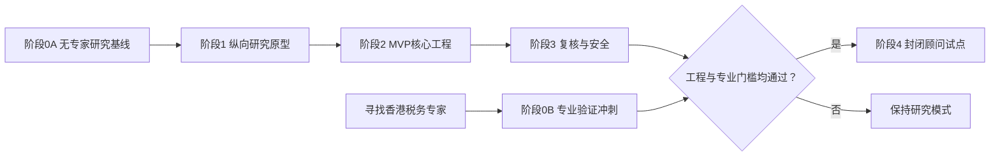

# 香港境外股息 FSIE 税务分析 Agent — 技术路线图

| 项目 | 内容 |
|---|---|
| 文档版本 | 0.2 |
| 日期 | 2026-08-15 |
| 状态 | 已加入无专家研究模式与专家验证门槛，待实施计划 |
| 关联文档 | [PRD](./PRD.md) |

## 1. 技术目标

构建一个受控、可审计的混合型税务 Agent：自然语言模型理解案件并组织访谈，版本化规则引擎执行确定性判断，RAG 提供权威依据，税务顾问完成主观判断和最终批准。

MVP 采用模块化单体，而非微服务，以降低早期部署、调试和数据一致性成本；各模块保持清晰接口，为后续拆分服务和增加司法管辖区知识包做准备。

## 2. 已确认技术决策

| 范畴 | 决策 | 理由 |
|---|---|---|
| 应用形态 | Web 案件工作台 | 便于访谈、事实确认和复核协作 |
| 后端 | Python API 服务 | 适合规则、文档处理和 AI 工具生态 |
| 核心数据库 | PostgreSQL | 同时支持关系、事务、JSON、全文检索和扩展 |
| MVP 向量检索 | pgvector | 将业务数据和首批法律向量放在同一数据平台 |
| 原始文件 | S3 兼容对象存储 | 与结构化案件数据分离 |
| 架构 | 模块化单体 | 控制首版复杂度 |
| 模型接入 | 供应商适配层 | 避免业务逻辑绑定单一模型 |
| 部署 | 托管式 PostgreSQL；试点优先单租户隔离环境 | 降低运维成本并保护敏感数据 |
| 规则管理 | Git 版本化规则 + 数据库发布记录 | 可评审、可回滚、可重现 |
| 搜索策略 | 关键词 + 向量混合检索 | 同时处理条文编号和语义问题 |
| 专业验证 | 规则和案例保存 `unverified/verified/rejected` 状态 | 允许先开发，但禁止未验证结果进入客户试点 |

PostgreSQL 的向量能力使用开源 [pgvector](https://github.com/pgvector/pgvector)。托管平台可以选择提供完整 PostgreSQL 的服务，但数据库设计不绑定某一家供应商；例如 [Supabase 官方文档](https://supabase.com/docs/guides/database/overview)明确其数据库为完整 PostgreSQL。

## 3. 逻辑架构

```text
Web案件工作台
    ↓
身份认证与应用API
    ↓
案件编排器
    ├── 事实卡服务
    ├── FSIE规则引擎
    ├── 法律资料检索服务
    ├── 报告生成服务
    └── 审计服务

数据层
    ├── PostgreSQL案件数据
    ├── PostgreSQL全文检索 + pgvector
    ├── 原始文件对象存储
    ├── Git规则仓库
    └── 专家案例评测库
```

## 4. 模块边界

### 4.1 案件编排器

提供受控工具：事实提取、冲突检测、下一个问题选择、事实确认、规则执行、资料检索、引用验证、报告生成和人工升级。

首版不采用多个自由协作 Agent，避免不可预测的循环、成本和责任边界。模型不得修改规则、跳过确认、将未知视为否定或在无来源时补写法律依据。

### 4.2 事实卡服务

统一保存候选、确认、未知、冲突和假设事实。每项事实关联信息来源、证据、修改历史及受影响规则节点。事实卡是所有分析的唯一案件事实来源。

### 4.3 规则引擎

- 简单条件使用版本化决策表；
- 复杂确定性逻辑使用带测试的代码；
- 经济实质充分性和主要目的等返回 `human_review_required`；
- 每次运行保存规则版本、输入事实版本和节点结果；
- 规则保存专业验证状态、验证人和验证时间；
- 未验证规则只能在研究环境运行，报告强制显示研究水印；
- 规则变更必须经单元测试、专家案例回归和专家批准。

### 4.4 RAG 与引用账本

资料处理流程：获取原件、保存哈希、结构化解析、按法律单元切分、添加权威和有效期元数据、审核、索引。

检索以“已确认事实 + 当前规则节点”生成查询，合并关键词和向量结果，按权威等级和有效期间过滤并重排序。每项结论保存来源、片段、规则节点、有效期和顾问确认状态。

### 4.5 报告服务

报告只能组合已确认事实、规则结果、人工判断和已验证引用。模型可以改善语言，但不得改变规则结果。事实或规则改变后，旧报告自动标记失效并保留历史版本。

### 4.6 知识管理后台

支持资料差异、权威等级、有效期、规则映射、审核发布和受影响规则查看。公共权威资料与客户内部资料必须分层并隔离。

## 5. 核心数据模型

建议首版实体：

- `organizations`, `users`, `roles`；
- `cases`, `entities`, `income_events`；
- `facts`, `fact_versions`, `evidence`；
- `interview_messages`, `question_queue`；
- `rule_sets`, `rule_nodes`, `rule_executions`；
- `legal_sources`, `legal_passages`, `citations`；
- `analysis_runs`, `reports`, `report_versions`；
- `human_decisions`, `audit_events`；
- `evaluation_cases`, `evaluation_runs`, `evaluation_results`。

所有业务表从第一天包含组织标识。删除采用受控工作流；审计事件不可由普通业务操作覆盖。

## 6. 安全与部署基线

- 单租户试点或严格隔离的云环境；
- 角色和案件级权限；
- TLS 传输、静态加密和独立密钥管理；
- 数据库、对象存储和备份使用一致的保留策略；
- 敏感日志脱敏，模型输入最小化；
- 用户资料默认不用于训练通用模型；
- 文件类型、病毒和提示词注入检测；
- 下载、导出、批准、知识和规则变更全部审计；
- 定期恢复演练；
- 部署地区和模型供应商需在试点前完成数据处理审查。

## 7. 工程质量与评测门槛

### 7.1 自动化测试层

1. 事实抽取：实体、日期、金额、持股和资金路径；
2. 对话策略：优先级、重复、未知和矛盾；
3. 规则单元测试：正常、边界、缺失和版本兼容；
4. 检索评测：召回、权威等级、有效版本和引用定位；
5. 报告测试：事实与引用一致性；
6. 安全测试：越权、租户隔离、文件输入和提示词攻击；
7. 端到端案例：研究阶段使用候选案例；试点前由香港税务专家审核形成 30–50 个金标案例。

### 7.2 上线阻断条件

- 任一确定性核心规则存在已知错误；
- 阻断性事实可以被静默跳过；
- 报告存在无法验证的法规或链接；
- 高风险案例未升级人工处理；
- 关键权限或租户隔离测试失败；
- 备份无法恢复；
- 规则、资料、模型或提示词更新后回归测试未通过。
- 核心规则、人工判断边界或金标案例尚未通过香港税务专家验证。

## 8. 分阶段路线图

当前工程团队可以在没有香港税务专家的情况下启动研究原型。建议采用双轨路线：工程轨持续推进，专家轨在封闭试点前完成；两条轨道汇合后才允许真实顾问试用。



### 阶段 0A — 无专家研究基线（2–3 周）

产出：

- 根据官方资料形成候选判断边界；
- 完成候选事实模型和规则节点清单；
- 建立官方资料清单、权威层级和版本规范；
- 准备首批 10 个候选案例，明确其尚非专业金标；
- 建立代码仓库、测试、数据库迁移和安全基线。

退出条件：所有资料和候选规则可追溯，研究模式及验证状态不可绕过。

### 阶段 1 — 纵向研究原型（2–3 周）

产出：

- 自然语言案件创建；
- 候选事实提取和基础事实卡；
- 动态追问最小闭环；
- 一条端到端候选 FSIE 判断路径；
- 少量官方资料检索和带研究水印的内部报告。

退出条件：5–10 个候选案例可稳定走完且结果可解释；此条件不代表税务正确性。

### 阶段 0B — 香港税务专家验证冲刺（1–2 个有效工作周）

该阶段可在工程阶段 1–3 期间并行进行，但必须在阶段 4 前完成。专家寻找和排期等待时间不计入有效工作周。

团队先提供“专家审核包”：

- 候选 FSIE 判断树和逐条官方依据；
- 未决专业问题和边界情况；
- 候选事实字段及追问顺序；
- 候选规则、人工判断节点和报告措辞；
- 30–50 个候选案例及系统输出。

专家负责批准、修改或否决规则，确认人工判断边界，并将案例转为专业金标。

退出条件：核心规则、判断边界和金标案例获得具备香港企业税经验的专业人士书面确认，并保存验证人、时间和版本。

### 阶段 2 — MVP 核心（3–4 周）

产出：

- 完整境外股息规则节点；
- 法律资料获取、解析、混合检索和引用账本；
- 事实确认、冲突和未知处理；
- 规则及报告版本；
- 完整内部复核稿；
- 扩充至 30–50 个候选案例；专家验证完成后转为金标案例。

退出条件：规则、检索和端到端工程门槛通过；若阶段 0B 尚未完成，产品继续保持研究模式。

### 阶段 3 — 复核、安全和运营（2–3 周）

产出：

- 顾问/复核人流程；
- 权限、审计、备份和恢复；
- 知识及规则审核发布；
- 异常停止、过期和影响分析；
- 监控、错误分类和成本记录。

退出条件：专业复核、安全检查和恢复测试通过。

### 阶段 4 — 封闭试点（2–4 周）

产出：

- 小范围真实顾问试用；
- 记录完成时间、修改率、引用接受率和错误类型；
- 优化访谈顺序、规则映射和报告模板；
- 形成是否进入 P1 的评审报告。

进入条件：阶段 0B 专业验证与阶段 3 工程、安全门槛全部通过。

退出条件：达到 PRD 试点成功指标，且不存在未控制的高风险错误类别。

主动工程和试点工作预计合计 11–17 周。香港税务专家的寻找、签约和排期等待时间不包含在内；等待不会阻止研究原型开发，但会推迟封闭试点。

## 9. MVP 后演进

### P1 — 香港增强

文件上传及事实抽取、组织架构解析、中英文报告、多顾问批注、Word/PDF 导出、主动法规更新监控和模板配置。

### P2 — 香港税务能力扩展

按境外利息、非知识产权处置收益、知识产权收入、一般利得税、税收协定和情景计算的顺序扩展。每个能力包均需独立规则、资料和金标案例。

### P3 — 亚洲税务平台

建议按香港、新加坡、中国内地逐步建设。每个司法管辖区维护独立资料库、规则包、事实扩展、报告模板和评测集。只有两个地区均通过质量门槛，才启用跨地区架构比较。

## 10. 关键风险与技术控制

| 风险 | 控制 |
|---|---|
| 模型幻觉 | 结构化输出、引用验证、无依据即停止 |
| 法规变化 | 哈希和差异检测、有效期、审核发布、回归测试 |
| 主观判断自动化 | 明确人工节点和强制批准 |
| 规则与资料不一致 | 影响检测、暂停相关结论、专家审核 |
| 数据泄露 | 隔离、最小权限、加密、脱敏和供应商审查 |
| RAG 检索遗漏 | 混合检索、权威过滤、金标查询和召回评测 |
| 技术过度复杂 | 模块化单体、PostgreSQL 首发、按瓶颈拆分 |
| 多地区规则污染 | 独立知识包、规则命名空间和地区测试集 |

## 11. 实施前待决事项

这些事项不改变总体架构；研究原型启动前确认基础项，封闭试点前确认其余项：

- 试点客户的数据存放地区和部署环境；
- 模型供应商及数据保留条款；
- 身份认证方式和是否对接企业单点登录；
- 香港税务专家、规则批准人和知识管理员；专家未确定时，候选规则不得进入已验证状态；
- 首批匿名案例的来源和脱敏流程；
- 报告模板的品牌及语言要求。
