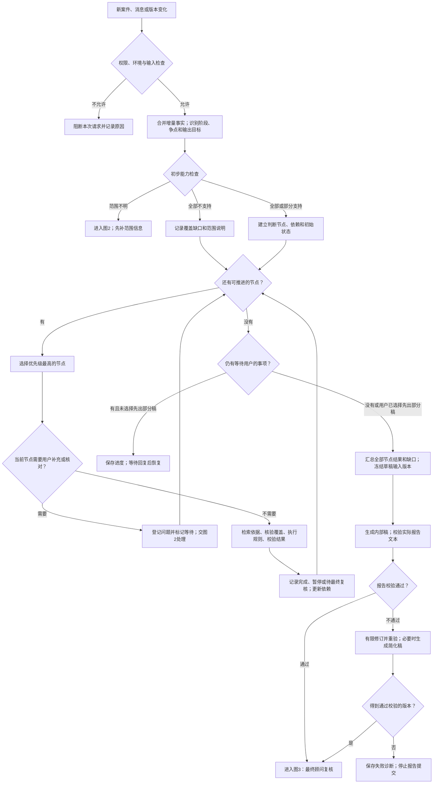
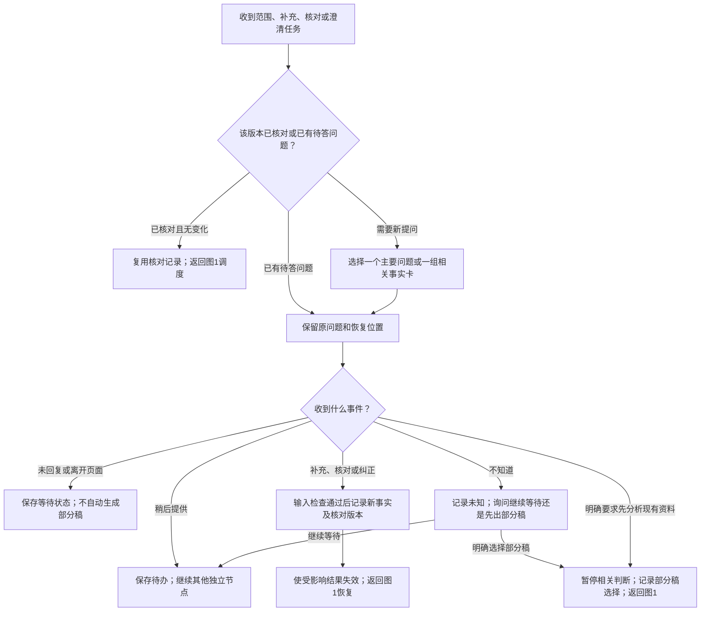
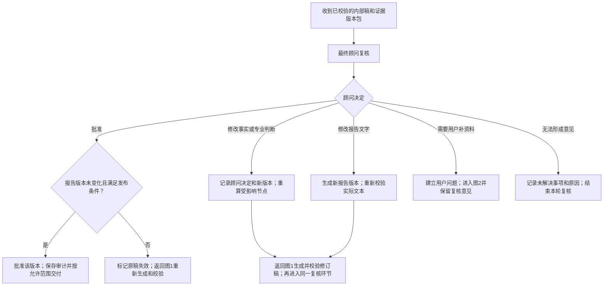
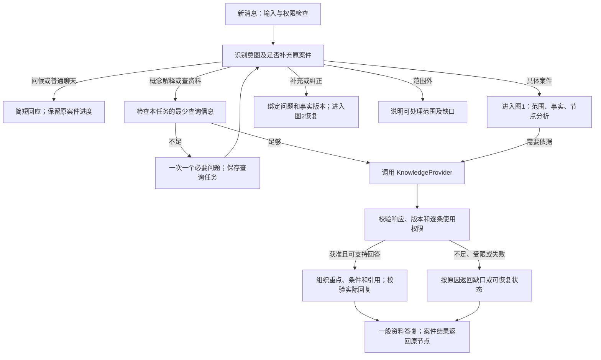
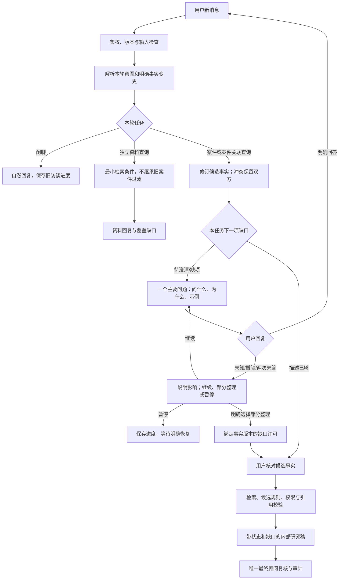

# B 模块：Agent 咨询业务流程 v0.3（对话入口与可插拔检索设计）

| 项目 | 内容 |
|---|---|
| 修订日期 | 2026-10-02 |
| 状态 | 已按流程评审修订的设计稿；业务代码及 PRD 尚待同步 |
| 负责人 | B 模块（Agent 与业务流程） |
| 首个可执行场景 | 香港境外股息 FSIE，L0 内部研究原型 |
| 文件位置 | 保留原文件名，便于已有链接继续使用；内容版本升级为 v0.3 |

## 1. 范围与运行原则

本稿依据 9 月 27 日分工和后续流程评审，定义场景路由、节点调度、用户追问、依据检索、报告校验和最终顾问复核。首条可执行流程仍以香港境外股息 FSIE 为起点，其他能力按独立规则包扩展。现行 [PRD](../product/PRD.md) 与[技术路线图](TECHNICAL_ROADMAP.md)需在实现本设计时同步。

具体触发条件、动作及状态见 [Agent 业务规则 v0.1](AGENT_BUSINESS_RULES_V0_1.md)，对应 [结构化规则配置](agent_business_rules.v0.1.json)。这些规则是待接入的设计契约。

**全流程只有一个顾问复核环节，位于内部稿生成并校验之后。** 中途由 Agent 向用户追问、核对提取结果和记录缺口。顾问可以在最终环节退回修改，修订稿再次进入同一个复核环节；一个复核环节不代表只能审核一轮。

用户核对的是案情记录是否准确，不会自动获得 `advisor_confirmed` 状态。主观判断、未解决冲突和缺失依据作为待核事项交最终顾问处理。系统不得为推进流程而将未知写成否定，或把暂停节点当作条件已满足。

L0 向模型发送的数据边界遵循 [D-002](../project/decisions/D-002-model-vendor-and-data-retention.md)，使用虚构或合成案件；候选规则和假设运行结果带研究标识。现行 [`policy.py`](../../packages/orchestration/policy.py)仍禁止方案优化。拟发生/已发生是案件阶段，还要记录税务主题、相关实体和法域、交易日期及用户要求的输出。

| 请求 | 当前处理 |
|---|---|
| 已发生的香港境外股息 | 收集实际事实和证据，形成待最终复核的 L0 研究稿 |
| 拟发生的香港境外股息 | 分别记录计划和假设，形成条件式研究分析 |
| 一般管辖地判定 | 先检查地区、主题和日期的能力包；无包时只给范围说明和资料需求 |
| 最优税务方案或多国比较 | 记录目标及现实约束；只处理已支持争点，未获支持的优化功能不执行 |

## 2. 三张流程图

以下三图是**具体案件分析**的处理流程。所有消息先经过第 10 节的对话入口：普通聊天不进入案件图；一般概念解释、资料查询走轻量检索路径；补充与纠正恢复原案件。轻量路径同样检查资料权限、引用和输出边界，不得用于绕过具体案件结论的事实和复核要求。

三张图共用同一个案件记录和版本号。图 1 调用图 2、图 3 时，保存恢复位置；跨图返回不代表重新开始整案。

### 2.1 主流程：处理节点，汇总后生成报告



“可推进”包括可执行分析或可登记一个新问题的节点；已登记且未收到答复的问题不再重复登记。一个节点完成或暂停后必须回到调度器，禁止直接跳到报告生成。调度器继续处理独立节点，等待节点的依赖项则保持阻塞。问题可以在后台排队，但每个案件同时只向用户展示一个主要问题或一组相关核对字段。

### 2.2 用户问答：按事实版本核对并恢复



没有回复不等于“不知道”，等待时长不能代替用户选择。新回复未通过权限或输入检查时，阻断本次输入并保留原待答问题，不执行事实更新。对“稍后提供”的事项，系统可以后台推进其他独立节点，但默认保留待答状态。用户明确选择部分稿时记录选择的范围；后续出现新的阻断问题，不能无限沿用旧选择。

### 2.3 最终顾问复核：批准、修订或退回



批准绑定报告版本、事实快照、规则版本、法源版本和校验结果。顾问修改会影响内容或依据的任何部分后，旧批准不能继承。顾问只改文字时不必重跑无关规则，但必须重新校验新文本；图中返回图 1 时跳过仍有效的执行结果。复核阶段没有顾问可用时保持 `pending_review`，不得自动批准。

### 2.4 图中各框如何理解

| 图/框 | 实际动作和退出条件 |
|---|---|
| 主流程：新案件、消息或版本变化 | 区分新案、补充、纠错和资料更新，定位恢复位置 |
| 权限、环境与输入检查 | 核验操作者和数据范围；拒绝当前输入时保留原案件 |
| 阻断本次请求 | 返回原因码并留痕，不把技术或权限错误写成税务结论 |
| 合并增量事实及分类 | 保留已有有效事实，仅对新增内容提取；重大目标变化才重新分类 |
| 初步能力检查 | 查能力目录是否支持地区、主题、期间与输出类型，避免无效长访谈 |
| 范围信息补充 | 仅问足以选择能力包的信息；返回后重新检查能力 |
| 记录覆盖缺口 | 无能力包时生成范围说明所需记录，不伪造分析结果 |
| 建立节点与依赖 | 把案件拆成需要判断的事项，定义前置条件、事实和来源需求 |
| 还有可推进节点/选择节点 | 按固定优先级调度，每次推进一个可执行动作 |
| 是否需要用户补充或核对 | 检查当前节点所需事实及核对版本，不要求填满整张词典 |
| 登记问题并等待 | 写入问题 ID 和等待字段，阻止重复提问；其他独立节点继续 |
| 检索、核验、规则与结果校验 | 按第4节顺序调用工具，每一步失败都有明确的节点状态 |
| 记录结果并更新依赖 | 保存节点结果和阻断原因，解锁或阻塞依赖节点 |
| 是否仍等待用户/保存进度 | 决定继续等待或按用户选择形成部分稿，保存可恢复状态 |
| 汇总并冻结草稿输入 | 全部节点都有去向，锁定本次报告使用的版本和缺口 |
| 生成并校验内部稿 | 校验实际写出的文字、数字、引用、假设和缺口 |
| 报告校验/有限修订 | 校验通过才可提交复核；失败按第6节修订或停止 |
| 修订版本检查/保存失败诊断 | 修订稿及简化稿也须通过校验；仍失败时停止提交并保存原因 |
| 问答：版本核对检查 | 识别同一值是否已核对、是否已有未答问题 |
| 复用记录/保留原问题 | 无变化时跳过重复确认，待答时不重新生成问句 |
| 选择问题或事实卡 | 一次一个主要问题；可将相关字段一起展示核对 |
| 事件分类、等待和待办 | 区分未回复、稍后提供、不知道和明确要求部分稿 |
| 记录新事实和核对记录 | 保存原值、新值、来源与用户核对的具体版本 |
| 使结果失效并恢复 | 只重跑受影响节点及其依赖项 |
| 暂停判断和部分稿选择 | 保留未知与冲突，登记用户允许本轮按哪些缺口出稿 |
| 复核：接收版本包 | 顾问能查看原始事实、引用、计算和未决事项 |
| 最终顾问复核/决定 | 唯一顾问环节，可以批准、修订、补资料或结束本轮 |
| 发布条件检查及版本批准 | 验证版本未变、校验有效及发布范围允许，再保存批准记录 |
| 事实、判断或文字修改 | 创建新版本；按影响范围重算或仅重做文本校验 |
| 建立补充问题 | 顾问退回的具体问题由 Agent 向用户收集 |
| 无法形成意见 | 结束本轮复核并保留原因，不把它记录为已批准 |

## 3. 节点调度与事实充分性

下列字段和状态为拟建业务契约，不能视为现有代码已经实现。

每个判断节点至少有 `node_id`、`issue_id`、`depends_on`、`required_facts`、`required_sources`、`status`、`reason_code`、`input_snapshot_id` 和结果引用。案件状态与节点状态分别保存。

| 节点状态 | 意义 | 能否再次调度 |
|---|---|---|
| `ready` | 前置条件成立，可执行分析或登记用户问题 | 可以 |
| `waiting_user` | 已有待答问题 | 新答复或用户明确改变等待选择后 |
| `blocked_dependency` | 所依赖的事实或判断尚不可用 | 上游变化后 |
| `paused_gap` | 范围、事实或来源有未解决缺口 | 缺口补齐或版本变化后 |
| `pending_final_judgment` | 需要顾问最终专业判断 | 最终复核提供判断后 |
| `completed` | 该版本分析完成 | 输入或依据变化后 |
| `not_applicable` | 按规则确定该节点不适用，已记录理由 | 相关事实变化后 |
| `technical_error` | 重试耗尽或工具契约错误 | 恢复事件或显式重试后 |
| `unsupported` | 能力目录不覆盖此争点 | 新能力包启用后 |

节点按范围阻断、结论阻断、支持性事项，以及规则顺序排序。多个状态同时出现时，先选影响当前节点的最高优先级事实，再按该事实的冲突、缺失或未核对状态决定动作。一次返回成功、暂停或失败后，必须写入状态再调度，避免同一输入无进展地循环。

节点前置条件由规则包定义，不能简单要求“所有上游都通过”：有些上游否定结果会启用另一条分支。上游未决时只阻塞依赖它的结论；独立路径仍可执行。每个依赖阻塞记录对应的上游节点与原因；创建节点图时检查引用和循环依赖，异常图不得静默停留在等待状态。模型不能自行把 `pending_final_judgment` 当作满足条件。

“足以做候选分析”要求：该节点的必需字段具备允许使用的值和来源，关键冲突已澄清，用于选取规则版本的日期可用，并且满足环境策略。缺失值不能自动补成假设。假设必须有出处、理由及适用范围；L0 由显式研究策略建立假设快照，原始候选状态仍保留。用户核对不赋予专业确认状态。

只有当所有纳入本轮的节点都已完成、有明确不适用理由或记录了暂停原因，且没有可继续推进的节点，才能准备汇总。仍有待答问题时默认等待；用户明确选择部分稿才能在这些问题未答时汇总。混合范围的案件分别保留已支持与未支持的争点。全案不支持时只形成范围说明，也必须经过报告文本校验。

## 4. 工具顺序与依据覆盖

| 工具/动作 | 触发条件 | 返回及下一步 |
|---|---|---|
| `screen_input` | 每条新增输入和文件 | `passed/flagged/blocked`；按环境策略处理，阻断输入不转中途顾问 |
| `classify_case_scope` | 新案、范围待明确或目标有重大变化 | 阶段、争点、法域候选、期间与输出目标；分类不等于法律结论 |
| `check_capability` | 初步分类后 | `supported/partial/unsupported/need_scope`；根据能力目录提早分流 |
| `extract_candidate_facts` | 有可处理的新内容 | 增量候选、原文定位、冲突；不能覆盖无关的已核对事实 |
| `decide_next_action` / 队列 | 每次事实、节点或版本变化后 | 下个节点和动作、原因码；无新信息时返回等待或汇总 |
| `record_user_fact_check` | 用户核对或纠正 | 具体值/版本的核对记录；事实仍属用户陈述 |
| `retrieve_legal_sources` | 节点事实足以构造查询 | 对应争点、日期和法域的法律单元、版本、支持及限制材料 |
| `check_coverage` | 已取得该节点检索结果 | `covered/gap/stale/conflict`；核验所需依据是否实际找回 |
| `run_tax_rules` | 前置条件、事实快照和依据均满足运行策略 | 确定性结果或待最终判断事项；不自行通过主观条件 |
| `verify_node_result` | 规则运行后 | 数值、单位、规则结果与引用校验；完成或暂停节点 |
| `draft_review_report` | 达到汇总条件 | 锁定版本的内部稿，包含所有缺口和未决事项 |
| `verify_report` | 每次生成或修改报告后 | 对实际文本逐项核对；通过才进入最终复核 |
| `review_report` | 已校验的版本包待审 | 顾问决定、作用范围和版本；重算/退回/批准路径见图3 |

能力目录检查确认“有没有该类能力”；案件覆盖核验确认“本次判断所需依据是否完整且适用”。两者之间必须发生实际检索。来源登记入库不代表它支持某项结论，引用存在也不代表引用内容能推出该结论。

每次调用由服务端可信上下文提供组织、用户权限和案件 ID，工具不得仅信任模型给出的身份。调用记录包括案件、争点、节点、请求 ID、事实快照、规则和来源版本、结果状态及原因码。写入和重试使用幂等标识。

临时超时和限流可以在预算内重试；权限错误、参数错误、缺少依据和需要主观判断不能通过盲目重试解决。模型适配层与编排器共用重试预算，避免层层重试放大调用次数。达到上限后记录技术错误；部分稿若包含失败节点，明确标示技术未完成，不能把它说成不存在法律依据。

## 5. 用户核对、等待和恢复

事实的来源/专业状态与用户核对记录分别存储。保留现有 `ai_candidate`、`client_statement`、`assumed` 等状态，并另记：

| 核对/问题字段 | 用途 |
|---|---|
| `fact_id + fact_version` | 标明核对针对哪一项事实、哪一版值 |
| `acknowledged_value_hash`、`acknowledged_by/at` | 防止值已变化却继续沿用旧核对 |
| `source_refs`、原始陈述和纠正说明 | 保留用户说了什么以及提取依据 |
| `question_id`、`question_type`、`asked_fact_versions` | 将范围、补充、核对和冲突澄清对应到问题 |
| `question_status` | 区分待答、稍后提供、已答、无法提供 |
| `resume_node_ids`、`partial_draft_scope` | 保存恢复位置，以及用户允许哪些未决事项进入部分稿 |

同一事实版本已有有效核对时不重复问；值改变、出现新冲突或影响判断的新证据到达时，重新检查受影响部分。新文件只是重复已有内容时，保留核对记录。用户核对界面可以批量展示相关字段，并允许直接纠正。

没有回复时只保存等待状态；“稍后提供”保存待办；“不知道”保存未知，并询问继续等待还是先出部分稿。明确选择后才改变出稿策略。澄清后仍冲突时保留双方证据和用户选择，不能靠模型多数投票选一个值。

恢复时按原案件 ID 合并增量事实，失效相关执行结果及依赖它们的结果；重新执行受影响节点，复用仍有效的其他节点。旧事实、旧报告及旧批准保留为历史版本。并发回复和重复请求按预期版本及请求 ID 处理；使用旧版本的写入须重新检查，不能静默覆盖较新的纠正。

## 6. 报告生成、校验与有限修订

所有出稿路径共用同一个检查：完整分析、部分分析、范围说明、缺口清单和待专业判断稿，都先生成文本，再检查实际文本。报告最少包括已处理范围、逐项分析状态、事实来源及假设、可支持的结论、引用、缺失资料、暂停项和待最终顾问判断事项。

| 检查 | 失败示例 | 处理 |
|---|---|---|
| 数值和单位一致 | 规则算得80万，报告写100万 | 修正后重验 |
| 引用支持度 | 引用存在，但不能支持该结论 | 补充有效依据或撤下主张 |
| 不确定性保留 | “尚无法确认”被改成“基本满足” | 恢复真实状态并检查相关结论 |
| 覆盖和未决事项完整 | 报告漏掉一个未支持法域或暂停节点 | 补齐缺口；不把局部分析写成整体结论 |
| 环境和版本一致 | 使用已失效结果或缺少L0标识 | 重新取有效快照生成；保留发布限制 |
| 内容输出范围 | 报告混入其他案件数据或未经允许的内容 | 阻断该报告提交，不把未通过校验文本交付 |

建议初始配置为每个草稿版本最多两轮自动修订（设计默认值，可通过实际评测调整）。修订后重新校验，不能直接送顾问。仍失败时可以撤下无法支持的实质主张，生成明确说明缺口的简化稿，但该简化稿也要重新校验。简化稿仍失败，则标记 `report_validation_failed`、保存诊断并停止报告提交；不得通过把失败稿送顾问来绕过校验。

不同校验可以由程序、检索证据检查和受限模型任务组合完成；单纯让生成模型回答“是否正确”不构成通过依据。最终校验结果绑定报告内容哈希和输入版本，校验后修改任何正文都会使该结果失效。

## 7. 最终复核与状态记录

案件工作流状态、节点状态、规则结果和报告发布状态分别保存，不能用一个 `human_review_required` 同时表示中途转人工和最终未决事项。

| 事件 | 案件/报告状态及动作 |
|---|---|
| 等待用户 | 保存 `waiting_user_response`（拟建）及待答问题；保留已完成节点 |
| 节点需主观判断 | 节点 `pending_final_judgment`；案件继续分析其他独立节点 |
| 内部稿通过文本校验 | 报告 `pending_review`，通知唯一的最终顾问环节 |
| 顾问要求补资料 | 记录复核意见与问题 ID，进入用户问答，原稿保持未批准 |
| 顾问改事实或专业判断 | 新增版本，使相关结果和草稿失效，自动重算并再次提交同一复核环节 |
| 顾问批准 | 核验批准对象仍为当前有效版本，保存顾问身份、理由、报告哈希及版本包 |
| 顾问无法形成意见 | 记录原因，结束本轮且不批准；以后可凭新资料重开 |
| 已批准后事实或法源变化 | 标记受影响批准/报告失效，显示历史状态；新版本重新复核 |

顾问批准不能提升环境发布等级，也不能把尚未验证的规则自动标成专业已验证。L0 即使完成顾问复核，输出范围仍为L0。最终复核界面应显示来源原文、事实版本、计算过程和待判清单，避免顾问从整段聊天记录重新拼案情。

## 8. 设计走查与后续验收场景

下表是后续联调的预期行为，本次仅用于设计走查，不代表已通过运行测试。

| 场景 | 预期行为 |
|---|---|
| 核对后上传重复文件 | 不重复核对同一事实版本，不重复执行有效节点 |
| 新文件改变金额 | 产生新事实版本，重核对相关值，失效受影响计算和报告 |
| 一个节点缺资料、另一节点独立 | 缺资料节点等待；独立节点继续；没有部分稿选择时保留等待 |
| 上游主观判断未决 | 依赖它的结论暂停，独立路径继续，未决事项进入最终稿 |
| 用户离开页面后返回 | 原案件、待答问题和恢复节点仍在，未自动出部分稿 |
| 用户不知道并选择部分稿 | 记录选择，未知不变成否定，报告明确列出缺口 |
| 一半争点不支持 | 尽早说明边界，支持部分继续，最终稿显示覆盖范围 |
| 工具超时 | 有限重试，耗尽后显示技术未完成，不伪装成法源缺失 |
| 规则正确而报告夸大 | 实际文本校验失败，修订或撤回该主张后重验 |
| 报告修订耗尽仍失败 | 不进入复核队列、不交付失败稿，保存诊断 |
| 顾问改金额或判断 | 重算受影响节点，修订稿校验后回到同一顾问环节 |
| 顾问审批时输入版本已更新 | 拒绝批准旧版本，重新生成有效版本并复核 |

## 9. 实施落点及模块交接

以上工具名、新状态和记录结构属于设计契约，尚需实现。现有 [`queues.py`](../../packages/orchestration/queues.py)将客户陈述、候选事实和冲突分配给顾问，须改为用户核对和澄清，并识别核对版本。现有 [`permissions.py`](../../packages/orchestration/permissions.py)仍限制事实确认状态提升，用户核对不能直接写入 `advisor_confirmed`。

L0 可以使用显式研究假设策略生成受限的候选分析；现有 [`intake/cli.py`](../../packages/intake/cli.py)直接将提取值交规则链运行的路径，需接入状态检查、快照和审计。如未来 L1 采用同一最终复核模式，必须实现受权限约束的预分析契约，不能将 L0 假设通道直接用于真实案件。

[`runner.py`](../../packages/rule_engine/runner.py)现有整链运行和终态归并，需要与节点依赖、暂停及增量失效配合；不能把它已经返回报告理解为本设计已实现。当前事实词典将 `regulated_financial_entity_status` 标为范围阻断字段，但规则包的 `scope.required_facts` 未列出，需由规则负责人核对覆盖。当前 API 还需案件、对话、事实核对、状态恢复及报告复核入口。

| B 模块交付 | 协作方 | 对接内容 |
|---|---|---|
| 场景、节点调度与原因码 | A（前端） | 待答、稍后提供、部分稿选择、事实卡及恢复交互 |
| 能力目录、检索及覆盖契约 | C（知识库） | 支持范围、适用期间、实际法源返回、例外和缺口 |
| 版本绑定的报告与校验结果 | A及顾问 | 原文证据、假设、计算和未决事项的复核界面 |
| 最终复核的修订回路 | 产品及顾问 | 批准、修改、退回和无法形成意见的状态及权限 |

实施优先级：先统一事实核对记录和节点状态，再打通可恢复调度与真实检索，随后接入报告文本校验，最后完成版本绑定的顾问复核回路。首版范围扩展另行更新能力目录与规则包。

## 10. 本周对话入口与 B 的职责边界

2026-10-02 更新：A 的页面已具备接入条件，C 的数据库尚未成型。B 本轮交付 Agent 与业务流程设计、检索契约、模拟检索行为和联调检查标准；前端页面及组件由 A 负责，知识数据库和检索实现由 C 负责。B 定义返回状态与内容结构，供 A 对接。



模型分类含糊时先澄清；一句话同时包含问候和业务内容时优先处理业务内容，不丢弃其中的事实更新。纯问候不会重置原案件，纯资料查询不创建整套案件事实队列。

轻量答复限于资料解释与查询结果；针对用户案件的资格、税额及专业判断必须返回案件流程。案件研究稿保持待最终复核，不增加中间顾问介入，也不自动标记为已批准。

## 11. 本周五项任务的设计补充与完成边界

| 工作项 | 已有设计 | 本次补充落点 | 尚待开发或联调 |
|---|---|---|---|
| 系统如何回应 | 范围、冲突、缺口、未知的处理原则 | 第10节入口；业务规则第9节场景及一句话行为 | 分类与回复处理器 |
| 必要追问 | 单主要问题、去重、未知不等于否定、版本核对 | 业务规则第10节最小输入及多轮示例 | 字段提取、队列及状态持久化 |
| 接检索并组织回答 | 检索、覆盖与引用校验原则 | KnowledgeProvider 契约；业务规则第11节回复结构 | Mock 实现与 C 真实适配器 |
| 无依据和调用失败 | 有限重试、缺口与技术故障分开、最终复核 | 业务规则第12节状态、原因码和提示 | 错误映射及恢复动作 |
| 联调及减少等待 | 复用、共享预算、避免重复处理 | 第13节分阶段验收；契约中的 Mock 场景 | A 真实页面联调、C 检索验收和耗时测量 |

本次补齐的是设计内容，不将其记为功能已实现。此前 47 条配置的分支检查也不等于对话或检索验收。

## 12. C 数据库尚未就绪时的接入安排

```text
A 已有页面 → B 的 Agent 与业务流程 → KnowledgeProvider
                                    ├─ MockKnowledgeProvider：开发/测试
                                    └─ CKnowledgeProvider：后续真实接入
```

完整定义见 [KnowledgeProvider 接口与模拟检索设计](KNOWLEDGE_PROVIDER_CONTRACT_V0_1.md)。B 的业务节点只依赖统一契约；C 后续提供 API、MCP 或只读数据库视图，由 CKnowledgeProvider 映射。字段可转换，权限、版本、适用期间和覆盖含义不能擅自补造。

提供方由服务端配置选择，模型和用户消息不能指定；真实服务不可用时返回失败，不自动切到 Mock 伪装成功。Mock 仅使用清楚标记的虚构资料，不能支持真实税务结论。B 的案件事实、待答问题和执行状态独立保存，不等待 C 的知识库来提供会话记忆。

## 13. 联调顺序与性能检查设计

1. **契约检查**：按接口文档和响应样例验证必填字段、状态组合、权限、原文定位及引用版本。
2. **Mock 流程检查**：用固定模拟场景验证入口、追问、回答结构、无匹配、权限限制和故障恢复。核查模型实际输入，不仅检查最终答复。
3. **与 A 联调**：B 提供消息类型、状态、问题和引用数据；A 负责页面接入。B 检查在实际页面操作下是否重复调用、丢状态或错配引用。
4. **接 C 后复测**：用相同测试问题及真实返回验证检索质量、权限、版本和引用。Mock 通过不替代此步。
5. **测量后优化**：同一 request_id/trace_id 关联路由、检索、模型、校验耗时和调用次数；未测数据为空，不写零。先消除重复检索、重复抽取和过长上下文，再评估分段输出。

检索结果仅在查询语义、范围/日期、必要事实版本、语料版本、权限策略及访问范围均仍有效时复用。模型生成失败可以复用仍有效的检索结果；用户改变关键事实或来源权限变化后必须重新检查。先接完整且校验后的回复，流式输出另行设计，避免未校验的实质结论提前展示。

## 2026-10-02：动态追问与场景入口细化

本轮实际实现见 [动态追问设计](../implementation/B_GUIDED_INTAKE_DESIGN_2026_10_02.md) 与 [用户侧字段核查表](../implementation/B_USER_FACT_FIELD_AUDIT_2026_10_02.md)。替换原先固定字段顺序：先识别候选场景，再按当前咨询目标选择必要描述；无法提供信息时保存缺口、等待用户明确选择继续/部分整理/暂停。



“没有新消息”不是一个自动推进条件；专业判断不回到中途顾问节点。查询失败与无匹配分开；混合消息已成功解析的事实可先保存，查询失败明确返回 partial_failure，并保留恢复位置。

## 2026-10-03：三个入口与自由对话的首版实现

详细方案见 [统一编排开发方案](../implementation/B_HYBRID_ORCHESTRATION_PLAN_2026_10_03.md)，验收见 [54 项场景矩阵](../implementation/B_HYBRID_ORCHESTRATION_ACCEPTANCE_2026_10_03.md)。三个快捷入口指定默认任务；主输入框先承接有效追问，再根据本轮意图自动选择共用业务子图。所有路径继续执行既有场景判断、事实/证据检查、兜底和唯一最终顾问复核。

本阶段已增加 entry_hint、任务状态、统一预算和有限动态调度，快捷按钮发送入口提示并进入对应编译子图。输入框修改预填内容会清除入口提示，主输入框按已有待答任务与新意图处理。混合任务中的独立资料查询按依赖与案件冲突分开；新消息不会自动清空原访谈进度。分析沿用事实确认、部分稿授权、版本及最终复核门槛。

本轮 256 项后端和 25 项页面回归通过，真实模型/C/PG 尚未验收。首版动态范围是最多三个任务的顺序调度及 no_match 后一次范围内改写；资料回答仍采用摘录模板。实际文件、开关与局限见详细方案第 17 节，不能将工程通过理解为专业税务结论可交付。

同日评测准备补充：明确要求列出已知信息时走只读 summary，返回已记录陈述及当前任务缺口，保留原追问进度；不等同 partial、confirm 或 analyze。金额明确更正检查支持万/亿等单位，不能把200万误记录为200。最新工程回归及62个多轮脚本见 [评测说明](../../evals/b_workflow/README.md)，真实模型仍等待免费密钥或已有套餐授权。
