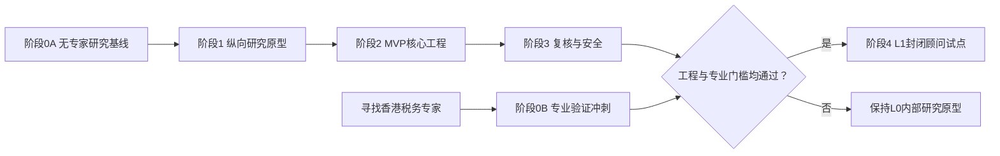

# 东亚税务 AI 平台（香港 FSIE MVP）— 技术路线图

| 项目 | 内容 |
|---|---|
| 文档版本 | v0.2 |
| 日期 | 2026-08-15 |
| 状态 | 已确认 L0 研究基线与条件式 L1 试点路线，待实施 |
| 关联文档 | [PRD](../product/PRD.md) |

## 1. 技术目标

构建一个受控、可审计的东亚税务平台：自然语言模型理解案件并组织访谈，版本化规则引擎执行确定性判断，RAG 提供权威依据，税务顾问完成主观判断和最终批准。2026 年范围为中国内地、香港、日本和韩国，其中香港境外股息是深度 MVP。

MVP 采用模块化单体，而非微服务，以降低早期部署、调试和数据一致性成本；各模块保持清晰接口，为后续拆分服务和增加司法管辖区知识包做准备。

发布等级沿用 PRD：L0 为内部研究原型，L1 为封闭顾问试点，L2 为正式客户能力。2026 年 12 月默认交付 L0；只有专家验证、安全与运营门槛全部通过后，香港能力才可进入 L1。L2 不属于 2026 年默认范围。

## 2. 已确认技术决策

| 范畴 | 决策 | 理由 |
|---|---|---|
| 应用形态 | Web 案件工作台 | 便于访谈、事实确认和复核协作 |
| 后端 | Python API 服务 | 适合规则、文档处理和 AI 工具生态 |
| 核心数据库 | PostgreSQL | 同时支持关系、事务、JSON、全文检索和扩展 |
| MVP 向量检索 | pgvector | 将业务数据和首批法律向量放在同一数据平台 |
| 原始文件 | S3 兼容对象存储 | 与结构化案件数据分离 |
| 架构 | 模块化单体 | 控制首版复杂度 |
| 模型接入 | 供应商适配层 | 避免业务逻辑绑定单一模型 |
| 部署 | L0 单组织研究环境；L1 优先单租户隔离环境；托管式 PostgreSQL | 降低运维成本并保护敏感数据 |
| 规则管理 | Git 版本化规则 + 数据库发布记录 | 可评审、可回滚、可重现 |
| 搜索策略 | 关键词 + 向量混合检索 | 同时处理条文编号和语义问题 |
| 专业验证 | 规则和案例保存 `unverified/verified/rejected` 状态 | 允许先开发，但禁止未验证结果进入客户试点 |

PostgreSQL 的向量能力使用开源 [pgvector](https://github.com/pgvector/pgvector)。托管平台可以选择提供完整 PostgreSQL 的服务，但数据库设计不绑定某一家供应商；例如 [Supabase 官方文档](https://supabase.com/docs/guides/database/overview)明确其数据库为完整 PostgreSQL。

## 3. 逻辑架构

```text
Web案件工作台
    ↓
身份认证与应用API
    ↓
案件编排器
    ├── 事实卡服务
    ├── FSIE规则引擎
    ├── 法律资料检索服务
    ├── 报告生成服务
    └── 审计服务

数据层
    ├── PostgreSQL案件数据
    ├── PostgreSQL全文检索 + pgvector
    ├── 原始文件对象存储
    ├── Git规则仓库
    └── 专家案例评测库
```

### 3.1 司法管辖区税务包

平台代码不得把香港规则写死。四个地区使用相同税务包接口：

```text
jurisdictions/
├── mainland_china/
├── hong_kong/
├── japan/
└── south_korea/

每个税务包包含：
├── jurisdiction metadata
├── official sources
├── source versions
├── tax topic taxonomy
├── candidate or verified rules
├── retrieval configuration
├── evaluation cases
└── report templates
```

税务包必须声明内容覆盖等级、最后更新时间和专业验证状态。香港包达到深度 MVP。中国内地、日本和韩国在 2026 年保守基线下达到 `source-catalog baseline`，包含官方来源目录、统一元数据、主题分类、覆盖缺口和验证状态；只有第二名全职工程师和知识运营负责人于 8 月 31 日前确认到位后，才启用八类主题全部达到 `standard research package` 的扩展目标。

## 4. 模块边界

### 4.1 案件编排器

提供受控工具：事实提取、冲突检测、下一个问题选择、事实确认、规则执行、资料检索、引用验证、报告生成和人工升级。

首版不采用多个自由协作 Agent，避免不可预测的循环、成本和责任边界。模型不得修改规则、跳过确认、将未知视为否定或在无来源时补写法律依据。

### 4.2 事实卡服务

统一保存候选、确认、未知、冲突和假设事实。每项事实关联信息来源、证据、修改历史及受影响规则节点。事实卡是所有分析的唯一案件事实来源。

### 4.3 规则引擎

- 简单条件使用版本化决策表；
- 复杂确定性逻辑使用带测试的代码；
- 经济实质充分性和主要目的等返回 `human_review_required`；
- 每次运行保存规则版本、输入事实版本和节点结果；
- 规则保存专业验证状态、验证人和验证时间；
- 未验证规则只能在研究环境运行，报告强制显示研究水印；
- 规则变更必须经单元测试、专家案例回归和专家批准。

### 4.4 RAG 与引用账本

资料处理流程：获取原件、保存哈希、结构化解析、按法律单元切分、添加权威和有效期元数据、审核、索引。

检索以“已确认事实 + 当前规则节点”生成查询，合并关键词和向量结果，按权威等级和有效期间过滤并重排序。每项结论保存来源、片段、规则节点、有效期和顾问确认状态。

香港 FSIE 包维护版本化 source manifest。每条记录至少包含 `source_id`、标题、发布机构、资料类型、原始链接、司法管辖区、语言、发布日期、`effective_from`、`effective_to`、抓取时间、内容哈希、权威等级、关联规则节点、支持或限制关系、替代版本、解析状态、专业验证状态和验证记录。

每次分析保存 `legal_coverage_cutoff`。截止日之后发布或生效的资料触发影响检查；未审核时受影响节点进入 `potentially_stale`，不得给出确定性专业结论。工程完整性检查 manifest、原件、哈希、解析、索引和链接；专业完整性由香港税务专家确认，二者不得互相替代。

### 4.5 报告服务

报告只能组合已确认事实、规则结果、人工判断和已验证引用。模型可以改善语言，但不得改变规则结果。事实或规则改变后，旧报告自动标记失效并保留历史版本。

### 4.6 知识管理后台

支持资料差异、权威等级、有效期、规则映射、审核发布和受影响规则查看。公共权威资料与客户内部资料必须分层并隔离。

后台按变化等级执行维护服务水平：重大法律或核心规则变化立即冻结受影响节点并在 2 个工作日内完成影响分级；重要 FAQ、DIPN、申报义务或官方示例每周检查并在 5 个工作日内初审；普通页面和元数据变化每月处理。每个地区保存 source owner、backup owner 和维护逾期状态；逾期内容不得继续标记为“最新”。机器翻译不得作为专业批准依据。

## 5. 核心数据模型

建议首版实体：

- `organizations`, `users`, `roles`；
- `cases`, `entities`, `income_events`；
- `facts`, `fact_versions`, `evidence`；
- `interview_messages`, `question_queue`；
- `rule_sets`, `rule_nodes`, `rule_executions`；
- `legal_sources`, `legal_passages`, `citations`；
- `analysis_runs`, `reports`, `report_versions`；
- `human_decisions`, `audit_events`；
- `evaluation_cases`, `evaluation_runs`, `evaluation_results`。

所有业务表从第一天包含组织标识。删除采用受控工作流；审计事件不可由普通业务操作覆盖。

## 6. 安全与部署基线

- 单租户试点或严格隔离的云环境；
- 角色和案件级权限；
- TLS 传输、静态加密和独立密钥管理；
- 数据库、对象存储和备份使用一致的保留策略；
- 敏感日志脱敏，模型输入最小化；
- 用户资料默认不用于训练通用模型；
- 文件类型、病毒和提示词注入检测；
- 下载、导出、批准、知识和规则变更全部审计；
- 定期恢复演练；
- 部署地区和模型供应商需在试点前完成数据处理审查。

## 7. 工程质量与评测门槛

### 7.1 自动化测试层

1. 事实抽取：实体、日期、金额、持股和资金路径；
2. 对话策略：优先级、重复、未知和矛盾；
3. 规则单元测试：正常、边界、缺失和版本兼容；
4. 检索评测：召回、权威等级、有效版本和引用定位；
5. 报告测试：事实与引用一致性；
6. 安全测试：越权、租户隔离、文件输入和提示词攻击；
7. 端到端案例：研究阶段使用候选案例；试点前由香港税务专家审核形成 30–50 个金标案例。

每项发布指标必须保存测试集版本、分母、计算公式、阈值、零容忍失败项、证据位置和批准人。关键事实识别完整率计算为：系统正确提取或明确追问的专家标注关键事实数 ÷ 专家标注关键事实总数。任何无法解析到 source manifest 的法规、条文或链接在冻结发布评测集中出现一次，即阻断对应发布。

L0 至少使用 10 个版本化候选案例完成端到端回归。L1 使用 30–50 个由香港税务专家确认覆盖矩阵的金标案例。三个地区的 `source-catalog baseline` 要求每个已声明主题至少有 1 个第一方官方入口、元数据必填项完整率 100%、发布快照断链为 0，且覆盖缺口和验证状态不得为空。

### 7.2 发布阻断条件

所有等级共同阻断条件：

- 任一确定性核心规则存在已知错误；
- 阻断性事实可以被静默跳过；
- 报告存在无法验证的法规或链接；
- 高风险案例未升级人工处理；
- 关键权限或租户隔离测试失败；
- 备份无法恢复；
- 规则、资料、模型或提示词更新后回归测试未通过；
- 研究状态、水印或专业验证门槛可以被普通用户绕过。

L1 额外阻断条件：核心规则、人工判断边界或金标案例尚未通过香港税务专家验证；部署地区、认证、模型数据处理、备份恢复和试点案件数据流程尚未通过审批。L0 不因专家尚未到位而停止，但只能在内部研究边界内运行。

## 8. 分阶段路线图

当前工程团队可以在没有香港税务专家的情况下启动 L0 内部研究原型。建议采用双轨路线：工程轨持续推进，专家轨在 L1 封闭顾问试点前完成；两条轨道汇合后才允许真实顾问试用。

2026 年日历映射：

| 截止时间 | 平台与香港 | 中国内地、日本、韩国 |
|---|---|---|
| 8 月 31 日 | 通用税务包规范、数据库及资料管线 | 确定官方资料入口和主题清单 |
| 9 月 20 日 | 香港纵向研究原型 | 建立三个地区的资料目录和元数据 |
| 10 月 18 日 | 香港 MVP 功能冻结 | 完成三个地区 source-catalog baseline；资源已确认时扩展标准研究包 |
| 11 月 8 日 | 香港达到 L1 门槛或明确保持 L0 | 未完成专家验证时保持 L0，不进入 L1 封闭顾问试点 |
| 12 月 6 日 | 集成、安全和发布候选版 | 四地区统一检索、版本和状态展示 |
| 12 月 18 日 | 东亚 Release 1 验收 | 停止新增范围，只修复阻断问题 |



### 阶段 0A — 无专家研究基线（2–3 周）

产出：

- 根据官方资料形成候选判断边界；
- 完成候选事实模型和规则节点清单；
- 建立官方资料清单、权威层级和版本规范；
- 准备首批 10 个候选案例，明确其尚非专业金标；
- 建立代码仓库、测试、数据库迁移和安全基线。

退出条件：所有资料和候选规则可追溯，研究模式及验证状态不可绕过；对应项目里程碑记录为 `pass` 或 `pass-with-approved-degradation`。

### 阶段 1 — 纵向研究原型（2–3 周）

产出：

- 自然语言案件创建；
- 候选事实提取和基础事实卡；
- 动态追问最小闭环；
- 一条端到端候选 FSIE 判断路径；
- 少量官方资料检索和带研究水印的内部报告。
- 使用虚构案例完成 3–5 次结构化工作流走查，验证交互和报告结构，不验证税务结论。

退出条件：至少 10 个候选案例可稳定走完且结果可解释；3–5 份工作流走查记录完成且未被标为专业金标。此条件不代表税务正确性。

### 阶段 0B — 香港税务专家验证冲刺（1–2 个有效工作周）

该阶段可在工程阶段 1–3 期间并行进行，但必须在阶段 4 前完成。专家寻找和排期等待时间不计入有效工作周。

团队先提供“专家审核包”：

- 候选 FSIE 判断树和逐条官方依据；
- 未决专业问题和边界情况；
- 候选事实字段及追问顺序；
- 候选规则、人工判断节点和报告措辞；
- 30–50 个候选案例及系统输出。

专家负责批准、修改或否决规则，确认人工判断边界，并将案例转为专业金标。

退出条件：核心规则、判断边界和金标案例获得具备香港企业税经验的专业人士书面确认，并保存验证人、时间和版本。

### 阶段 2 — MVP 核心（3–4 周）

产出：

- 完整境外股息规则节点；
- 法律资料获取、解析、混合检索和引用账本；
- 事实确认、冲突和未知处理；
- 规则及报告版本；
- 完整内部复核稿；
- L0 保持至少 10 个版本化候选案例；若准备进入 L1，扩充至 30–50 个并经专家确认覆盖矩阵后转为金标案例。

退出条件：规则、检索和端到端工程门槛通过；若阶段 0B 尚未完成，产品继续保持 L0 内部研究原型。

### 阶段 3 — 复核、安全和运营（2–3 周）

产出：

- 顾问/复核人流程；
- 权限、审计、备份和恢复；
- 知识及规则审核发布；
- 异常停止、过期和影响分析；
- 监控、错误分类和成本记录。

退出条件：L0 的权限、安全检查和恢复测试通过；若准备进入 L1，专业复核和最终试点架构的安全检查同时通过。

### 阶段 4 — L1 封闭试点（2–4 周）

产出：

- 小范围真实顾问试用；
- 记录完成时间、修改率、引用接受率和错误类型；
- 优化访谈顺序、规则映射和报告模板；
- 形成是否继续 L1 及进入后续产品阶段的评审报告。

进入条件：阶段 0B 专业验证与阶段 3 工程、安全门槛全部通过。

退出条件：达到 PRD 试点成功指标，且不存在未控制的高风险错误类别。

主动工程和试点工作从 2026 年 8 月中旬持续至 12 月 18 日。香港税务专家的寻找、签约和排期等待不会阻止 L0 内部研究原型和其他三个地区资料包开发，但会决定香港能否从 L0 进入 L1 封闭顾问试点。

## 9. MVP 后演进

### P1 — 2026 东亚 Release 1

在香港 MVP 之外完成中国内地、日本和韩国 `source-catalog baseline`，统一支持官方来源检索、有效期、内容覆盖和专业验证状态展示。八类主题全部达到 `standard research package` 仅在额外工程和知识运营资源按期确认后启用。

### P2 — Release 1 后增强

增加文件事实抽取、协作和导出；同时按境外利息、非知识产权处置收益、知识产权收入及更多地区规则化场景扩展。每个能力包均需独立规则、资料和金标案例。

### P3 — 2027 亚太扩展

东亚 Release 1 验收后，再根据客户需求和专家网络增加其他亚太司法管辖区。每个地区维护独立资料库、规则包、事实扩展、报告模板和评测集；不得为了扩大地图覆盖而降低来源和验证要求。

## 10. 关键风险与技术控制

| 风险 | 控制 |
|---|---|
| 模型幻觉 | 结构化输出、引用验证、无依据即停止 |
| 法规变化 | 哈希和差异检测、有效期、审核发布、回归测试 |
| 主观判断自动化 | 明确人工节点和强制批准 |
| 规则与资料不一致 | 影响检测、暂停相关结论、专家审核 |
| 数据泄露 | 隔离、最小权限、加密、脱敏和供应商审查 |
| RAG 检索遗漏 | 混合检索、权威过滤、金标查询和召回评测 |
| 技术过度复杂 | 模块化单体、PostgreSQL 首发、按瓶颈拆分 |
| 多地区规则污染 | 独立知识包、规则命名空间和地区测试集 |

## 11. 实施前决策门槛

| 决策 | 最迟日期 | 临时默认值 | Accountable owner | 未决定时阻断事项 |
|---|---|---|---|---|
| 案例来源和脱敏流程 | 2026-08-20 | 只使用虚构案例 | 产品/隐私负责人 | 任何真实或匿名案例导入 |
| 模型供应商和数据保留条款 | 2026-08-31 | 只允许合成数据，保留供应商适配层 | 技术/隐私负责人 | 试点数据进入模型 |
| 租户隔离策略 | 2026-08-31 | L0 单组织运行，但保留 `organization_id` | 技术负责人 | 权限模型和数据库接口冻结 |
| 身份认证方式 | 2026-09-20 | L0 使用受控本地账号 | 技术/安全负责人 | L1 权限与审计验收 |
| 报告语言与模板 | 2026-09-20 | 中文正文，保留英文法源名称 | 产品负责人 | 报告模板功能冻结 |
| 部署地区、密钥和备份方案 | 2026-10-18 | 不部署真实试点数据 | 技术/安全负责人 | L1 环境搭建和安全测试 |
| 香港税务专家和规则批准人 | L1 前 | 所有候选规则保持未验证 | 产品/专业验证负责人 | L1 封闭顾问试点 |

超过日期而未完成决策时，相关工作流自动保持 L0 或停止，不得以临时架构完成 L1 安全验收。
