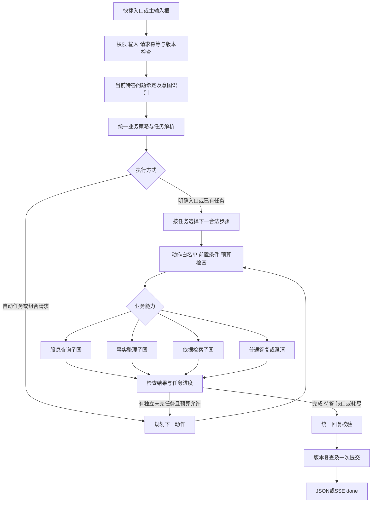

# B：三个业务入口与自由对话的统一编排开发方案

日期：2026-10-03。状态：**设计及首版执行记录；工程实现与本地联调已完成，真实模型、C 与 PostgreSQL 验收待进行。** 本次改动未提交或推送，执行范围见第 17 节。

本方案基于本地 `feat/b-agent-workflow` 当前实现。职责：A 负责页面与交互；B 负责 Agent、业务流程、接口和校验；C 负责资料库、授权元数据及检索。当前业务范围继续为香港企业境外股息 FSIE 研究原型。顾问仅在最终复核介入。

## 1. 目标与验收范围

三个快捷入口指定默认业务流程；主聊天输入框支持自动判断、承接待答问题、处理混合任务，并在执行预算内决定下一步。两类入口调用相同的业务组件、使用同一份案件状态、执行相同规则。

“固定流程”指固定业务步骤和前置判断；已知事实跳过，所问问题随咨询目标变化。“自由对话”允许动态选择已注册动作，执行权限、资料授权、事实充分性和复核条件由程序检查。

本轮交付范围：入口契约、任务状态、统一路由、三个业务子图、有限动态调度、兜底与验收。仍不包含通用多国税务规则、多交易依赖图、任意代码/SQL 执行、后台长任务、自动批准，以及自由生成的长篇税务报告。资料答复先沿用可校验的摘录和模板，保证动态编排不会扩大现有输出能力。

## 2. 核查基线：哪些已有，哪些新增

| 能力 | 代码与当前状态 | 本轮安排 |
|---|---|---|
| 快捷按钮 | `apps/web/src/workspace.ts` 定义三个预填问题，`App.tsx` 仅填输入框 | 增加入口提示，由 A 接入；支持旧请求 |
| 模型意图理解 | `packages/chat/service.py` 的 `turn_prompt/validate_turn` 支持 chat/research/intake/clarify/unsupported | 保留五类意图；在其上增加任务解析，不能用新规划器取代旧校验 |
| 每轮编排 | `packages/agent/workflow.py`，route → facts → 按需 retrieve → compose → validate | 分离共享节点与业务子图；新增调度器 |
| 动态追问 | `packages/agent/dialogue.py`，guided-intake-0.2 | 保留字段、unknown、冲突、暂停和部分稿规则，增加任务归属 |
| 检索 | `contracts.py/providers.py/knowledge.py`，Mock、legacy、C HTTP 插槽 | 继续 KnowledgeProvider；添加统一预算、调用去重和任务上下文 |
| 分析与复核 | `ChatService.confirm/run/review`、`packages/chat/analysis.py`、`packages/agent/review.py` | 复用全部准入条件；提取无写入分析步骤，避免图中嵌套服务提交 |
| 持久化 | ChatStore 的案件 JSON、revision 和请求回执 | 扩展 JSON 状态和回执摘要；保留一个权威状态源 |
| 动态执行循环 | 目前未实现；模型入口分类后由代码决定路径 | 新增有限的“选择动作 → 检查 → 执行 → 观察”循环 |
| 47 条 BR 规则 | 有文档及配置，部分行为已以 Python 实现 | 逐组追踪；不把 DSL 配置存在等同于执行器完成 |

上表记录改造前基线。上一轮为 199 项 Python、42 项动态访谈测试、20 个浏览器用例（包含针对性复验）；本轮新增运行记录见第 17 节，工程结果不代表真实模型/C/专业正确性验收。

## 3. 技术选型与总体结构

- FastAPI、Pydantic v2、现有模型适配器、SQLAlchemy 和现有 LangGraph 锁定版本继续使用；本次不因架构整理升级依赖。
- LangGraph 外层图负责统一准入、路由、调度和提交前检查；三个子图负责明确业务任务。
- Harness 在这里是 B 的运行控制模块：可用动作、上下文投影、统一预算、重复调用检测、错误恢复和运行记录；不是另一个必须采购或接入的框架。
- 模型规划使用现有结构化 JSON 适配器。原生 tool calling 可后续适配，首版不要求模型供应商更换，也不依赖任意工具发现。
- 继续每轮计算后一次案件事务提交。用户等待通过保存任务和问题后结束 HTTP 请求实现；本轮不增加另一套 LangGraph checkpointer。

LangGraph 支持预定工作流与动态 Agent，也支持通过子图复用节点；这里采用父图包装子图输入/输出，防止子图随意写入全局状态。[工作流与 Agent](https://docs.langchain.com/oss/python/langgraph/workflows-agents)、[子图文档](https://docs.langchain.com/oss/python/langgraph/use-subgraphs)。



完整研究稿通过分析准入、报告校验后进入唯一最终顾问复核。普通聊天、资料摘要、事实清单不因这个流程图而被自动送审或标成已批准。

## 4. 分清四种概念

| 概念 | 字段/值 | 含义 |
|---|---|---|
| 入口提示 | entry_hint：auto/dividend_consultation/fact_intake/reference_lookup | 本次从哪个入口进入，不是案件事实或分析许可 |
| 消息意图 | chat/research/intake/clarify/unsupported | 沿用现有分类，判断这句话包含什么 |
| 当前任务 | task.kind：consultation/fact_intake/reference_lookup | 当前持续要完成什么；普通寒暄可不建立任务 |
| 案件咨询目标 | consultation_goal：scope/receipt/participation/substance/full_analysis | 决定哪些案件事实与规则必要，继续保留于现有字段体系 |

`mode` 不同时承担以上四种含义。主输入框发送 `auto` 也不代表丢弃既有任务。`entry_hint` 仅在点击入口后的那次发送携带，之后通过服务端任务状态承接。

“境外股息”按钮保留显示文案亦可，内部映射 dividend_consultation；是否改为“股息咨询”由 A 决定。它不会自动填写收入类型、公司主体、香港地区或 full_analysis。可预置的是任务主题，实际事实必须来自用户描述。

如果点击后用户修改预填文本，A 清除入口提示；若 A 保留选中任务，也必须明确展示选中状态。B 始终识别当前文本，明确新指令优先于旧提示，疑义只问一个范围问题。

法规资料库中的专用检索框保持直接查资料，不调用自由对话规划器；本方案“自由输入”指主聊天输入框。

## 5. 统一意图识别与决策顺序

所有入口都执行下列顺序；确定性规则处理清楚的控制词，其他语言交给模型解释，然后验证结构和事实字段。

1. 检查访问权限、入模许可、输入长度、请求回执、案件版本。失败直接返回错误，不调模型或 C。
2. 读取当前 task、active pending、事实和冻结报告。精确回答只绑定当前有效且未暂停的问题；相同字段的新问题 ID 不自动接受旧卡片回复。
3. 识别暂停、继续、部分整理、明确更正、新案件、任务切换和混合意图。先生成受校验的候选 patch，暂不提交数据库。
4. 确定任务：本轮明确指令优先；明确回复当前问题则继续；入口提示提供初始方向；无明确方向时结合任务上下文；仍有歧义就澄清。问候、感谢不取消既有任务。
5. 区分个人案件陈述、一般咨询与假设举例。仅用户明确给出的当前案件事实可入 patch；参考案例、按钮、检索结果不能产生客户事实。
6. 计算各子任务的事实依赖。冲突只阻塞依赖它的任务；与当前案件无关的资料查询仍可进行。
7. 检查能力范围、任务必需字段、证据覆盖和版本，再允许执行对应动作。
8. 汇总本轮结果，最多输出一个主要问题；问题已发出则结束本轮，禁止模型继续自答。

**本轮对旧行为的明确细化**：旧代码遇到“事实冲突＋research”通常整体转向澄清并保存查询。本轮要根据 uses_case 和事实依赖区分：案件相关查询可以挂起；独立查资料仍可执行，最终回复附一条案件冲突问题。不能笼统覆盖此前所有冲突处理。

`uses_case` 是模型提出、策略验证的布尔值；只有本轮明确引用当前案件或正在推进已绑定案件的任务才允许携带其过滤条件。独立编号查询不继承旧日期、金额或主体。

## 6. 三个业务子图

### 6.1 股息咨询 consultation_graph

入口 → 判断一般问答/自身案件 → 一般问题走依据检索；自身案件走候选识别 → 选择当前问题所需字段 → 追问或分析准备 → 依据检查 → 输出当前问题答复/研究稿。

- 一般概念、法规清单不强制收集案件四项入口字段；涉及具体税务规则、税率、条件的解释必须检索。
- 分析自身案件时复用 recipient_type、income_type、analysis_jurisdiction、consultation_goal 四项候选识别，再按目标收集描述。四项齐全仅表示候选场景识别完成。
- 个案缺必需事实：问一个问题；用户明确选择部分整理时输出事实与缺口。生成有缺口研究稿还必须通过现有 partial_consent 和确认事实门槛。
- 有明确分析请求、最新事实已通过 `/confirm`、分析依赖满足或已接受相应缺口，才可执行分析。点击入口、普通“好的”、模型判断不得替代确认事实或接受缺口。
- 目前仅实现香港企业境外股息个案分析。个人、其他收入或其他法域个案形成范围说明；有支持的独立子问题可以继续。一般资料查询仍受 C 的实际语料覆盖限制，不默认为全球可查。
- 主观判断保留支持/反对材料和未决事项，完整稿统一进入最后复核。没有顾问时保留待复核状态。

完成条件：当前问题已有经校验的回答；或明确等待用户、事实确认、缺口补充/最终复核。不能无限推进直到“全案所有条件已满足”。

### 6.2 事实整理 intake_graph

入口 → 判断“要准备清单”还是“整理自身情况” → 提取候选事实 → 更正/冲突检查 → 按目标计算缺口 → 选择一个主要问题 → 保存问题或输出事实清单。

- 用户问通用材料清单：直接提供准备说明；涉及具体法定要求则附检索依据，不启动自身案件访谈。
- 自身情况的事实清单包含已知陈述、来源、未知/暂缺、冲突双方、缺口影响；资格和充分性仍是候选陈述。
- 沿用现金/非现金分支、实际/计划日期、税种描述等现有逻辑，不新增未经依据支持的税务阈值。
- 用户一次回答多个字段时一次保存全部有效信息，只问下一项。未知不变 no/0；明确无材料记录 deferred。
- 每个问题在相同任务与有效事实上下文下最多展示两次；用户主动恢复可重显待答问题，不增加无意义的重复惩罚。
- 请求事实整理不自动启动规则分析，也不自动确认所有事实；整理结束后告知可核对事实，再决定是否分析。

完成条件：用户要求的事实摘要已提供、必要信息已整理待核对，或需要等待用户。用户提前停止时可以提供带缺口的事实摘要，不冒充完整案件分析。

### 6.3 依据检索 reference_graph

入口 → 解析查询与使用范围 → 必要的检索澄清 → C 请求 → 授权与适用性过滤 → 覆盖判断 → 摘录/引用/缺口。

- 查询只补检索需要的法域、主题、条文编号或适用期间。查一般概览可以没有交易日期，不能强制问公司、金额或持股。
- 泛指“股息”且法域不明时询问法域；明确香港或当前已选择的业务主题可按公开查询范围检索，但范围提示不能写成用户事实。
- `SearchRequest` 默认 HK/dividend 是当前代码行为；新查询构建器必须验证真实查询范围。明确其他法域不得静默套默认值；当前 Provider 不支持时返回覆盖缺口。
- 独立查询 uses_case=false。案件查询只发送契约批准的事实过滤字段，不把 53 个字段和全对话全部送 C。
- 两种权限分别检查。仅可展示的原文由展示通道返回；模型规划器、摘要、历史和观测信息均不得携带该原文或其变相摘要。
- 第一次 no_match 允许在用户范围内改写一次关键词；不能改法域、主体、期间、权限身份以制造结果。来源受限、版本冲突不靠改写查询绕过。
- 输出固定为回答重点、适用范围/条件、对应引用、缺口。实际回答能力沿用摘录与模板，不将其宣传为成熟的自由生成法律解释。

完成条件：返回可用资料或具体缺口/技术错误；不默认附上完整案件访谈。

## 7. Harness 的动态动作与执行限制

模型先得到过滤后的业务上下文和当前 allowed_actions，输出下一步的结构化建议；Pydantic 验证后由策略模块重新计算允许性。模型输出不直接执行 Python、SQL、HTTP URL 或写数据库。

| 动作 | 执行条件 | 返回与停止条件 |
|---|---|---|
| reply_chat | 普通聊天/产品问题；不含需要法规支持的具体税务主张 | 经检查直接结束 |
| clarify_request | 当前任务不明或范围歧义 | 一个主要问题，结束本轮 |
| collect_facts | 当前案件任务或明确补充/更正 | patch 和 gap/question 提案；问用户即结束 |
| lookup_reference | 有明确查询，范围可用 | 受权限过滤的结果；可有一次有理由的补查 |
| prepare_analysis | 用户明确请求研究稿 | 缺确认则返回 A 的核对入口；不自行调用 confirm |
| run_analysis | 最新事实确认、明确分析请求、范围/缺口许可/预算均满足 | 调共享无写入分析函数，校验后准备待复核稿 |
| finish | 各子任务已有结果或明确去向 | 统一校验、提交和返回 |

pause/resume/new_case 属于受校验的用户控制事件，优先由确定性策略处理，不由模型随意安排。review/approve 不属于 Agent 可用工具。

分析函数重构前 run_analysis 不加入动态白名单；使用现有 `/confirm`、`/analyze` 完成同一业务流程。不能在图内部调用当前 `ChatService.run()` 导致嵌套事务和旧 revision 提交。

动态循环终止：已有回复、需要用户回答、需要事实确认、范围不支持、受限资料、无新证据、预算耗尽、不可恢复故障。只有“尚有明确未完成且可推进的子任务”才允许再次规划；模型自述“还可以更好”不构成继续理由。

## 8. 运行预算、上下文与去重

下表为开发起始默认值，需用真实模型/C 的耗时实测后调优，不是现有性能承诺。固定入口与 auto 使用同一个请求预算；子图不能重置计数。

| 项目 | 起始限制 | 耗尽后动作 |
|---|---|---|
| 单轮外部工作总时间 | 45 秒；为提交及响应预留约 5 秒，早于现有 JSON 65 秒客户端超时 | 结束可中止调用，输出已验证结果与未完成项 |
| 模型调用 | 总计最多 4 次，含初次意图理解、后续规划和一次格式修复 | 不再规划，确定性结束；不得另开子图重置 |
| 单次模型时间 | 当前为 min(模型配置, 本轮剩余时间)；2026-10-04 在线超时后调整，整轮仍为45秒 | model_failed；是否保留已验证步骤见第 11 节 |
| 业务动作派发 | 每轮最多 4 次，三个业务子图与分析动作均计数 | 保存待办并结束，不循环调用同一子图 |
| 待执行混合子任务 | 最多 3 项，串行执行；超出时说明并请用户选当前重点 | 保留后续描述，不静默丢弃 |
| search_evidence 实际调用 | 每轮合计最多 3 次，包括首次、关键词改写和传输重试 | no_match 与故障按最后真实状态分别表示 |
| 同一查询技术重试 | 最多 1 次，且共享 search 总预算与截止时间 | 显示可恢复故障；权限/契约错误不重试 |
| get_evidence 原文读取 | 每轮最多 14 次，按 reference/purpose 去重，含分析额外检索 | 未取得的原文形成明确缺口 |
| 单次检索时间 | 延续 SearchRequest 默认 3000ms 并取总剩余预算较小者；原文读取也设置真实客户端超时 | 不只检查调用前时间；不能阻塞超过总预算 |
| 主要追问 | 每条回复最多 1 个；同项最多两次主动追问 | 未知/无材料立即提供下一步选择 |
| 报告修订 | 沿用 BR-35 最多两轮、BR-36 最多一次简化；本轮摘录模板不增加自由生成修订器 | 不重置报告周期预算，不交付失败稿 |

LangGraph recursion_limit 仅作程序异常保险，具体值按重构后的最大合法节点数设置并测试；不能把现有值 10 当成模型调用或检索次数预算。

预算透传到嵌套分析和 related_rulings 检索，所有 Provider 调用由 wrapper 计数。客户端取消后取消尚未开始的步骤；已运行的同步函数即使无法立即终止，也不能继续提交或触发后续调用。

同轮去重键包含 owner、case_id（案件检索时）、事实快照、任务范围、规范化 query、日期、过滤条件、用途。相同键的成功结果复用；同一故障只可使用剩余技术重试预算。跨轮缓存首版关闭；未来开启须同时校验语料版本、权限策略版本和引用有效性。

规划上下文只提供最近必要对话、任务状态、允许的事实、当前问题及授权结果。展示原文与模型可用原文使用不同投影；工具材料是数据，材料中的“切换模式/批准案件/忽略规则”等文字不得变成控制指令。日志记录动作、原因码、耗时、版本和引用 ID，不记录隐藏推理或未获准原文。

## 9. 任务状态与等待恢复

案件事实仍在 `Case.facts`，追问细节仍在 `Case.dialogue`。新增 `Case.orchestration` 只保存任务控制与执行摘要，禁止重复存一份可独立修改的事实或完整 pending。

```json
{
  "orchestration": {
    "schema_version": "0.1.0",
    "active_task": {
      "id": "server-task-id",
      "kind": "fact_intake",
      "status": "waiting_user",
      "origin": "shortcut",
      "uses_case": true,
      "facts_hash": "server-computed",
      "pending_question_id": "existing-dialogue-question-id"
    },
    "suspended_task": null,
    "queued_tasks": [],
    "last_run": {
      "request_id": "uuid",
      "status": "waiting_user",
      "reason_code": "fact_collection",
      "policy_version": "hybrid-0.1",
      "actions": ["collect_facts"]
    }
  }
}
```

任务状态限定：active/waiting_user/waiting_confirmation/paused/completed/blocked_gap/failed。报告待复核状态沿用 Analysis，不混入任务状态。顶层 workflow.status 保留既有 A 枚举；新增细节放 task_results，避免页面把新枚举显示为空。

首版支持一个活动任务、一个暂停任务，混合请求队列最多三项；不支持无限任务栈。再次切换时说明旧任务已暂停并保留摘要，不能覆盖未处理请求；需要第三个持续任务时澄清本次重点。队列只代表对话中后续步骤，没有后台自动运行。

pending 绑定 task_id、question_id、案件 revision 与相关事实快照；revision 变动后重新检查依赖，不能因为新增闲聊消息就机械作废问题。partial_consent 继续与事实哈希绑定；切换模式不扩大授权，生成稿仍必须列出全部缺口。

恢复优先级：当前问题有效回答 → 明确恢复/重试 → 明确切换 → 独立插问 → 普通闲聊。暂停后的孤立“是/不知道”不能写入旧字段。用户明确提供完整事实描述时可以恢复，仍须更正/冲突检查。

## 10. A 的接口与页面衔接

### 10.1 请求扩展

沿用 `/api/cases/{id}/messages`，为 JSON 和 SSE 同时增加可选字段：

```json
{
  "revision": 12,
  "request_id": "00000000-0000-4000-8000-000000000001",
  "text": "帮我整理这笔股息的情况",
  "data_approved": true,
  "entry_hint": "fact_intake",
  "reply_to_question_id": null
}
```

旧客户端不传 entry_hint 等价 auto，继续承接服务端 task；不能重置任务。reply_to_question_id 由 A 有效问题卡填写；提供过期 ID 时返回明确问题状态并要求重新对齐，不错误写事实。自由文字未带 ID 时仍可按 active pending 严格解析。

请求回执摘要包含 text、entry_hint、reply_to_question_id、数据许可及操作类型。相同 request_id 相同 payload 返回已提交结果，不再次调用模型/C；相同 ID 不同 payload 返回 409 request_payload_conflict。重试必须保留原文本和入口提示，用户编辑后使用新 ID。

### 10.2 返回扩展

- Case.orchestration：恢复任务所需状态；Message.question 保留现有对象，增加 task_id。
- workflow.entry_hint/effective_task/policy_version：记录入口和实际执行方向，方便检查按钮是否生效。
- workflow.task_results：每个子任务的 kind/status/reason_code/result_ref；用来同时显示“事实已保存、检索失败”。
- 顶层已输出问题时仍 waiting_user；检索原因保留 research.reason_code 和 retrieval_reason_code。技术故障记录 error_code/retryable，不被追问状态覆盖而消失。
- 使用现有 JSON 和 SSE done 为最终权威状态。首版不流式输出未经校验的正文；如需进度事件，只提供 queued/running/tool_finished 等状态，先由 A 兼容未知事件。

A 的具体工作：快捷按钮传 entry_hint；编辑草稿后处理失效提示；重试保留 payload；显示当前任务和恢复入口；按 question 渲染一次追问；显示混合任务部分成功；保留核对事实和分析按钮。无需重做页面布局。

### 10.3 分析与确认

`/facts`、`/confirm`、`/analyze`、最终 review 路由继续可独立调用，并执行相同策略。动态调度必须与这些端点共用 `analysis_eligibility`，不能复制一份较宽松规则。

确认事实、同意部分输出、允许模型处理资料、批准报告是四种不同动作。主输入框可以提出分析意图，但首版事实确认仍通过已有明确页面动作完成；上下文中的“确认”不自动等价调用 `/confirm`。

## 11. 写入、并发、取消与兜底

每轮子图只产生结果提案。最终 `commit_prepared` 在同一事务提交有效 patch、任务状态、用户/助手消息、冲突历史和回执。顶层提交后才向前端宣称“已保存”。

| 情况 | 规定行为 | 返回/持久化 |
|---|---|---|
| 初次模型不可用/JSON 不合法 | 不生成事实；最多一次格式修复且计入总预算 | 沿用 model_failed/model_not_configured，草稿保留 |
| 后续规划失败但已取得合法结果 | 结束动态循环，确定性汇总已校验结果 | 可提交有效 patch，标 partial_failure；未执行事项明确列出 |
| 缺事实/unknown/deferred | 沿用一次一问、影响说明与选择 | waiting_user；不查 C 来猜客户事实 |
| 真正冲突 | 保留 previous/candidate，阻塞依赖任务 | 保存冲突；独立检索可继续 |
| no_match | 最多一次范围内改写；仍无结果则说明缺口 | 正常业务回复，不返回伪装的服务故障 |
| C 超时/不可用 | 有限技术重试，不自动切 Mock | 独立查询沿用 knowledge_unavailable；混合任务可提交有效事实并标 partial_failure |
| 权限不明/拒绝/版本哈希不匹配 | 排除资料，记录缺口 | 不扩大身份或绕过授权；展示和入模分别判断 |
| 依据相互冲突/需主观判断 | 整理分歧与适用条件，暂停该结论 | 标记最终复核事项，中间无顾问调用 |
| 超范围 | 说明具体不支持的任务；独立受支持任务继续 | unsupported 子结果；不套 HK 默认规则 |
| 同动作重复且无新输入/结果 | 停止循环，复用有效结果或说明未推进 | no_progress；不能通过换 task_id 重置预算 |
| 达到总预算 | 不启动新工作，保留已验证结果和恢复线索 | budget_exhausted，不声称整个任务已完成 |
| 并发版本变化 | 拒绝旧快照提交；重新加载 | 409 revision 冲突，不能自动覆盖用户修改 |
| 用户取消/连接断开 | 提交前不写入；停止后续工作 | 提交与断连竞态靠 request_id 查询已有结果，不能承诺断连总能撤销已提交事务 |
| 新事实使旧报告失效 | 现有 invalidate 保守失效；未来细化依赖 | 原报告保留、旧批准不可复用 |
| 报告校验失败 | 移除不支持内容，按 BR-35～37 有限处理 | 失败稿不能转顾问来替代程序校验 |

进程退出发生在提交前：没有承诺中途结果已保存，使用原 request_id 可重算；提交后重试读取回执。未来若要长任务跨进程逐步恢复，需要独立运行账本，本轮不以单次最终提交冒充逐工具持久恢复。

## 12. 既有 47 条业务规则的继承矩阵

统一策略模块应返回 rule_id、decision、reason_code 和事实/版本依赖；这里只记录可解释的业务决定，不输出模型隐式推理。BR 编号语义保留，新增入口调度规则使用 HY-*，不改写原 JSON 假装全部已执行。

| 规则 | 现有基础 | 新编排执行位置 / 本轮边界 |
|---|---|---|
| BR-01～03 | API 权限、输入与数据许可已有 | admission；两个入口完全一致 |
| BR-04～07 | supported/identification 已有；完整多争点能力包未实现 | task_resolver/scope；只拆支持的子任务，广义多国拆分保留设计 |
| BR-08～09 | 完整节点依赖 DAG 尚未落实 | task_queue 校验已注册类型与顺序；不声称完成任意 DAG 调度 |
| BR-10～15 | pending/冲突/缺口/确认已有基础 | intake/analysis_eligibility；候选与确认事实不能混同专业核实 |
| BR-16～18 | KnowledgeProvider 与候选规则已有 | reference/analysis；资料覆盖检查与合法执行条件集中校验 |
| BR-19～21 | review_tasks、输出校验已有基础 | analysis/validate；专业未决项仅汇入最终复核 |
| BR-22～25 | 单流程与部分稿已有；通用独立节点聚合不完整 | 最多三个子任务按依赖执行，每项必须有结果或明确去向 |
| BR-26～29 | unknown/partial_consent/更正/版本已有 | dialogue + task 恢复；本轮绑定 task/question ID |
| BR-30～31 | retrieve 有有限重试 | harness 统一预算含嵌套调用；不叠加出无限重试 |
| BR-32～34 | 报告版本、哈希、校验及最终复核已有基础 | 共享报告管线，所有入口一致 |
| BR-35～37 | 完整自动改文/简化执行器尚未实现 | 保留修订预算规范；首版模板校验失败终止，不启用无约束生成修复 |
| BR-38～41 | reviewer 授权、报告哈希与批准阻断已有基础 | 最终 review 服务；普通任务模式不能绕过 |
| BR-42～45 | 完整顾问编辑/退回交互尚未全部落实 | 保留最终复核闭环规划，本轮不新增中途人工任务 |
| BR-46～47 | 事实变更失效与同值避免重写已有 | 继续保守失效；本轮仅同轮调用复用，完整来源依赖失效后续实现 |

新增策略：HY-01 入口仅提示；HY-02 active pending 优先绑定；HY-03 独立查询隔离案件；HY-04 子任务依赖决定阻断；HY-05 全局预算；HY-06 一个问题后结束；HY-07 子图只能返回提案；HY-08 同请求幂等；HY-09 原文权限覆盖所有规划上下文；HY-10 task 完成不等于报告获批。

## 13. C 接入与知识边界

继续使用 [KnowledgeProvider 契约](../architecture/KNOWLEDGE_PROVIDER_CONTRACT_V0_1.md)。B 不设计 C 的数据库表，不从浏览器直连数据库。HTTP 或后续 MCP 都通过 Provider 适配器接入；MCP 只是调用通道，不承担任务路由或税务判断。

现有 schema_version=0.1.0、SearchRequest/Result 与五个 fact_filters 保留。task_id/budget 等先留在 B，不向 C 发送契约外字段；新的区域能力或过滤需求必须单独版本化协商。owner 和 case_id 由服务端可信上下文提供，不采信模型输出。

C 联调清单：法域/主题/期间覆盖，actual/planned/unknown，来源定位/版本/hash，两类权限、错误可重试性、coverage 不足、单次耗时和硬超时。Mock 成功不能当成 C 成功；真实服务失败不能改用模拟税务依据。

## 14. 文件落点与开发工作包

以下为冻结时的工作包；实际首版文件与完成情况见第 17 节。三个业务子图实际编译在 `hybrid.py` 内，复用共享执行方法，没有额外创建 `subgraphs/` 目录。

| 阶段 | B 的改动落点 | 验收出口 | 依赖 |
|---|---|---|---|
| P0 契约与规则冻结 | 新 `task_contracts.py`；旧五意图、旧回复和回执兼容样例 | 明确枚举、优先级、状态映射；审查 47 BR 继承和 HY 规则 | 当前代码即可 |
| P1 入口与任务状态 | `apps/api/chat.py`、`service.py`、`store.py`；新 `task_state.py` | 三入口能记录任务；旧请求、刷新、暂停、问题绑定、幂等都正确 | A 按接口接按钮；可先 API 验证 |
| P2 共享策略及三个子图 | 新 `policy.py`、`subgraphs/{consultation,intake,reference}.py`；重构 `workflow.py` | 同输入从按钮/auto 进入相同子图时业务结果一致；旧规则回归 | P0/P1 |
| P3 有限动态循环 | 新 `harness.py`、`budget.py`；Provider 包装；模型任务解析 | 混合任务、观察后补查、硬预算、无进展停止和恢复通过 | P2；受控模型测试先行 |
| P4 分析及上下文校验 | 共享 `analysis_eligibility`、无写入分析步骤；修改 `analysis.py/knowledge.py` 调用边界 | 动态分析与 `/analyze` 相同条件；嵌套预算与资料权限不漏 | P2/P3 |
| P5 A 联调与评测 | `workspace.ts/api.ts/useWorkspace.ts/App.tsx/Welcome.tsx` 接口协作；测试集 | JSON/SSE、入口、切换、部分失败、旧对话、真实模型识别评测 | A 页面与可用模型；C 可先 Mock |
| P6 真实 C 与发布准备 | Provider 契约测试、耗时记录、按环境能力启用 | C 真实返回与权限可验；真实 PG 并发/复核验证；范围清楚 | C 服务与授权资料 |

P0～P2 为可独立验收的首批，随后开 P3 动态调度；P4 完成前自动规划只可 prepare_analysis 并引导现有分析按钮。每批停止点均为可运行的功能状态，不以“后续统一补校验”作为完成条件。

预计 B 工程工作量：P0～P2 约 3～4 个工作日，P3～P4 约 2～3 日，P5 约 1～2 日；这是规划估算，不含 A/C 等待、真实模型调优和专业规则修订。P6 以外部接口就绪为条件，不承诺固定日历日期。

## 15. 验收、启用与回退

详细场景见 [验收矩阵](B_HYBRID_ORCHESTRATION_ACCEPTANCE_2026_10_03.md)。沿用原 199 项后端用例与页面关键路径，新增测试针对任务/预算/权限边界，避免逐函数镜像测试。

三层验收：受控模型与 Mock 验证确定性行为；真实模型验证分类/抽取/下一步选择；真实 C 验证检索、版本、权限和适用性。三个层次分别记录结果。

真实模型初始冻结集：至少 60 个多轮合成脚本，覆盖矩阵所有行为组和改写/否定/混合表达；两名项目评审者先统一期望动作，专业结论另由专业人员判定。记录路由正确率、澄清合理率、事实错误写入率、重复追问率、成功完成率、P50/P95 耗时和调用数；初始目标路由正确率≥95%，所有越权/擅自批准/未知转否定等边界用例零违规。指标不等于生产错误率保证。

已增加服务端开关 `FSIE_AGENT_ORCHESTRATION=legacy|hybrid` 和 `FSIE_AGENT_DYNAMIC_PLANNER=false|true`，正式启动默认 legacy/false。本地测试启动器默认 hybrid，但关闭真实动态规划，使用受控模型边界；浏览器和模型不能修改开关。

旧 Case 缺 orchestration 时懒初始化，dialogue/事实/报告保留。rollback 到 legacy 必须先通过兼容投影：保留活动 pending、将 deferred_query 从待办恢复为旧字段、保留无法在旧流程执行的任务并说明暂停；验证暂停期间孤立“是”不会恢复写入。不能简单忽略新状态而误绑定问题。回退不改变 C Provider、不覆盖已存事实或自动批准报告。

完成标准：验收矩阵的首发必需项全部通过，旧核心流程不回退，文档准确标注真实模型/C/PG的完成边界；未通过真实模型时动态规划只开放测试环境，未接真实 C 时继续显著标记合成资料。

## 16. 与既有文档的关系

- [动态追问实现](B_GUIDED_INTAKE_DESIGN_2026_10_02.md)：保留已落地语义，任务绑定与独立检索冲突细化按本文新增。
- [字段核查](B_USER_FACT_FIELD_AUDIT_2026_10_02.md)：继续作为用户事实来源与适用字段基线。
- [业务规则](../architecture/AGENT_BUSINESS_RULES_V0_1.md)：BR-01～47 保持业务含义，本文第 12 节明确工程落地边界。
- [业务流程](../architecture/AGENT_BUSINESS_WORKFLOW_V0_1.md)：入口和调度演进按本文，唯一最终顾问复核保持。
- [原实施计划](B_AGENT_IMPLEMENTATION_PLAN_2026_10_02.md)：保留历史完成记录，新增 hybrid 单独记录。

## 17. 2026-10-03 首版执行记录

工作区：`Asia-Tax-AI-Agent-B`，分支 `feat/b-agent-workflow`，基于 A 的 `Zhihong-Wu@7054c45323abf7d63d9725f03f81dab892c98110`。本轮为本地未提交改动，未推送 GitHub。

| 工作包 | 已完成的工程范围 | 仍待验收 |
|---|---|---|
| P0/P1 | entry_hint、reply_to_question_id、任务投影；请求 payload 哈希与幂等；旧请求和旧案件兼容 | 真实 PG 并发与部署 |
| P2 | 父图与咨询/事实整理/资料查询三个编译子图；共用事实、追问、检索与校验 | 真实模型表达覆盖 |
| P3 | 初次结构化解析最多三个任务；独立任务顺序执行；no_match 最多一次范围内改写；单轮预算、复用、暂停/恢复 | 在线模型下一步选择的质量 |
| P4 | 共享 analysis_eligibility 与无写入 report_proposal；所有入口使用同一分析准入和最终复核条件；资料权限覆盖历史与规划观测 | 专业税务正确性、顾问团队账号分配 |
| P5 | A 页面三个入口、编辑后清除提示、原请求重试、任务恢复、多个检索结果和失败提示；JSON/SSE 回归 | 真实模型多轮冻结集 |
| P6 | 保留 C HTTP 适配器、契约和模拟夹具；增加传输读取期限及响应大小限制 | C 实际服务、权限语义、资料覆盖与耗时 |

主要新增文件：`packages/agent/{task_contracts,task_state,policy,hybrid,harness,budget,analysis_policy}.py`；主要集成位置：`packages/chat/service.py`、`packages/chat/streaming.py`、`apps/api/chat.py` 及 A 现有聊天组件。模块可从 `docs/implementation/B_AGENT_LOCAL_RUN_AND_HANDOFF.md` 的启动与接口说明开始联调。

三入口绑定 `dividend_consultation`、`fact_intake`、`reference_lookup`；主输入框为 `auto`。入口是用户方向提示，事实来源与输出许可仍由共用策略检查。一般准备问题不会因为点击“境外股息”就被写成真实案件。需要追问时只提出一个主要问题并结束当轮；已知信息跳过，unknown 与没有严格区分。

动态范围为受限的任务选择与补查。初次模型理解可提出最多三个任务；观察后只允许 finish、lookup_reference 或 prepare_analysis，动作仍需程序检查，首版实际补查仅用于 no_match 的一次改写。不能改变原法域、日期、数字或案例编号，不能确认或批准案件。当前保留一个活动任务、一个暂停任务和有限队列，超过持续任务容量会要求用户确定重点，不静默覆盖。

单轮预算为 45 秒、模型调用最多 4 次、动作最多 4 次、search 最多 3 次、原文读取最多 14 次，嵌套分析、格式修复及技术重试共用预算。模型单次最多 15 秒，C 检索沿用请求 deadline，C 原文读取最多 1 秒；响应读取中检查累计时长与 2 MB 大小。同轮相同范围检索可复用；模型只收到安全观测，资料原文不会进入规划上下文。这是同步调用的期限检查，不提供进程级硬中断保证；部署仍需网关及数据库超时配置。

独立查询不继承案件冲突与过滤；依赖案件事实的任务会先解决缺口。混合消息的有效事实可在查询失败后保存并标 partial_failure；独立查询服务故障继续给技术错误。首个任务的有效回答、多个检索束、后续未完成任务均保留，不用一次补查覆盖整轮结果。事实变化、部分输出授权、版本冲突及最终复核沿用既有约束。

本轮验证：

- `.venv/bin/python -m pytest -q -m 'not integration'`：**256 passed、11 deselected**。其中 54 个新增混合编排用例、3 个传输期限用例；其余为既有 199 项回归。
- `apps/web` 在 `FSIE_TEST_ORCHESTRATION=hybrid` 下完整 Playwright：**25 passed**，包括 5 个新增入口/重试用例。
- TypeScript 与 Vite 构建：通过。工作区空白错误检查：通过。
- 真实模型配置安全检查：未配置。本轮没有真实模型调用；动态调度由受控规划输出验证。未接真实 C，11 项真实 PG 集成未运行。

以上不是 H01～H54 全部层次通过的声明。真实模型的理解、问法、任务分解与调度质量，C 的真实权限/版本/覆盖，以及专业结论正确性仍待外部验收。正式启动保持 legacy/false，手动测试页可先检查新编排的工程行为；资料回复仍为摘录、条件和缺口模板，没有新增自由生成长篇税务解释或通用 47 条 DSL 执行器。
