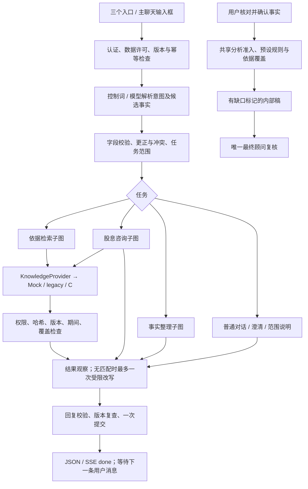

# B 模块交接：Agent、业务规则与 A/C 联调

更新：2026-10-04。负责人：子健（B）。工作分支：`zijian-Luo`。

这份文档是队友的阅读入口：解释当前已经实现的业务流程、如何运行和接入，以及仍需共同决定的事项。历史设计、详细规则与验收材料保留在文末链接中。本次交付为香港企业境外股息 FSIE 的研究原型，所有专业未决事项汇入**最后一次顾问复核**。

## 1. 分工与交付范围

| 成员 | 职责 | 本次需要配合的内容 |
|---|---|---|
| A | 前端、登录、交互与页面状态 | 保留现有消息协议，传入口提示和问题 ID，展示事实、引用、缺口与失败；后续建设顾问复核和文件上传页面 |
| B | Agent 编排、业务规则、事实追问、输出与复核服务 | 将用户输入转成受校验的候选事实和任务，通过统一接口调用 C，检查结果并保存案件状态 |
| C | 资料库、法条与案例、索引检索、资料权限和版本元数据 | 实现/确认 KnowledgeProvider 契约，返回证据来源、定位、版本、权限、适用期间与覆盖缺口 |

本次提供：共用 LangGraph 父图、三个业务子图、受限动态调度、候选场景识别、目标相关追问、冲突与更正、可替换检索接口、结构化摘录答复、报告冻结与最终复核 API、A 的兼容字段，以及多轮评测脚本。A 的页面只增加必要接线；B 不接管前端产品设计，也不设计 C 的数据库表结构。

## 2. 当前能力与证据边界

- 工程流程可在测试模型和 Mock 检索下运行；真实模型评测使用生产解析器、LangGraph 和实际 API 路由，只有身份与 C 检索是测试替身。
- 2026-10-04 提交前的工程检查：270 项 Python 通过、11 项真实 PostgreSQL 测试未运行；26 项页面测试通过；TypeScript/Vite 构建和知识包校验通过。若后续整合上游导致数字变化，以 PR 的最新验证记录为准。
- 免费模型已成功处理部分对话、语言切换、案情提取和追问，但连续全流程仍被限流/超时阻断；混合更正也暴露行为失败。**没有完整真实模型全流程通过报告，不能把工程回归当作在线验收。** 具体失败保存在 `evals/b_workflow/runs/`。
- C 真实接口、真实检索质量、完整数据库部署、顾问跨账号分配与税务专业正确性仍待验收。
- 47 条业务规则 JSON 是设计基线，部分已落实为 Python 策略；当前没有通用规则 DSL 执行器。
- 法规答复主要采用授权摘录、适用条件和缺口模板。完整自由生成式的法律解释、案例事实对比与案例适用性推理仍待建设。
- 当前聊天输入框仅支持文本，单条最多 4000 字符；尚未支持 PDF、DOC、DOCX 的上传、解析或 OCR。安装 PDF 库不代表已接通文件输入。

## 3. 技术结构与一次消息的处理

沿用 FastAPI、React/Vite、SQLAlchemy、Pydantic 和项目的 OpenAI 兼容模型适配器；编排使用 LangGraph。Harness 是本项目的受限运行控制逻辑，负责动作白名单、预算、结果观察与停止条件。



跨轮状态存在 ChatStore 的案件记录中：事实、修订、冲突、问题、任务、确认快照、报告与请求回执。LangGraph 执行一轮消息，等待用户时保存状态后结束请求；没有另建节点级 checkpoint 或后台自治任务系统。

## 4. 三个入口与主对话框

| 页面入口 | `entry_hint` | 默认业务方向 | 后续行为 |
|---|---|---|---|
| 境外股息 | `dividend_consultation` | 股息咨询、分析准备 | 一般规定查询走检索；自身案件按目标收事实、追问，确认后才分析 |
| 梳理事实 | `fact_intake` | 案情整理、缺口与材料清单 | 通用准备清单不强制个案访谈；自身案情提取候选事实，一次问一个主要问题 |
| 查阅依据 | `reference_lookup` | 法条、指引、案例资料 | 只问检索必需的地区/期间/编号，不要求填全案件，不继承无关旧案过滤 |
| 主聊天输入框 | `auto` | 根据当前消息和任务判断 | 保留普通聊天、追问承接、更正、暂停/恢复与混合请求；受同一业务规则约束 |

入口提示不构成案件事实或分析授权。用户编辑快捷预填文字后，A 清除提示；明确的新指令优先。三个预设首句话可以通过确定性逻辑处理，后续自由描述仍需模型理解。模型负责提出候选意图和事实，程序负责允许哪些动作。

资料页面的专用搜索框直接查资料；它与主聊天输入框的自动任务调度不同。

## 5. 场景识别与期望行为

| 场景 | 系统行为 | 主要限制 |
|---|---|---|
| 问候、感谢、语言切换、产品问题 | 自然回复 | 不查库，不写入案件事实，不批准报告 |
| 一般概念或具体税务条件 | 一般非税务知识可回复；具体税率/规则/资格须查依据 | 不用模型记忆生成个案结论 |
| 问题目的不清 | 问一个简短范围问题 | 不默认启动全表访谈 |
| 用户描述自身案件 | 提取本轮明确提供的候选事实 | 不从按钮、假设或参考案例创造客户事实 |
| 用户补充信息 | 保存有效变化，跳过已知字段 | 一次可接收多个字段，一次只问一个主要问题 |
| 用户明确更正 | 验证更正原文与新值，保存新版本 | 单位万/亿、百分比、月份需一致；旧分析失效 |
| 新旧信息不同、未明确更正 | 保存冲突双方，要求澄清 | 不静默覆盖；独立查资料仍可继续 |
| 不知道、暂时无材料 | 保留 unknown / deferred，说明缺口影响 | 不转换成 no、零或条件不满足，不无限重复追问 |
| 只要求已知事实摘要 | 只读汇总已知信息和待补项 | 不确认事实，不授权部分稿，不取消原问题 |
| 暂停、切话题、恢复 | 保留任务和问题，按新消息恢复或切换 | 孤立“是”不能回答已暂停的问题；新客户不覆盖旧案件 |
| 超出当前案件范围 | 说明覆盖范围，可继续独立且支持的查询 | 不把个人/其他地区个案套进香港企业规则 |
| 要求开始分析 | 检查最新事实确认、范围及缺口许可 | 部分稿需明确同意，事实确认不是顾问批准 |

候选场景识别先收四项：`recipient_type`、`income_type`、`analysis_jurisdiction`、`consultation_goal`。四项齐全仅代表可以识别候选场景，不表示可以给最终税务结论。

按目标补字段：范围问题收基础主体/集团/交易时间描述；收取问题收资金或非现金流转；参股问题收持股比例、方式、期间及税项描述；经济实质问题收员工、场所、活动与支出。姓名、完整银行账号等不是默认追问内容。合法资格与充分性从原始描述中保留为未决事项，最终复核。

## 6. 业务规则怎么设置和修改

| 文件 | 用途 |
|---|---|
| `docs/architecture/agent_business_rules.v0.1.json` | 47 条 BR 设计基线、条件、动作与限制 |
| `packages/agent/dialogue.py` | 追问字段、目标依赖、未知/暂缺、摘要、部分许可、更正和问句 |
| `packages/agent/policy.py` | 范围、税务主张过滤、查询改写限制、规则原因码映射 |
| `packages/agent/task_state.py`、`task_contracts.py` | 三入口、任务承接、暂停队列和候选任务契约 |
| `packages/agent/analysis_policy.py` | 聊天与分析按钮共同使用的分析准入 |
| `packages/agent/knowledge.py`、`review.py` | 证据授权和输出校验、唯一最终复核 |
| `knowledge/hong_kong/fsie/rules.json`、`packages/rule_engine/` | 有来源定位的税务候选判断规则 |

修改顺序：先写场景/触发条件/期望行为/反例 → 标明对应 BR/HY 与执行文件 → 修改策略或契约 → 增加有实际风险的检查用例 → 联调 → 保存规则和评测版本。仅改 JSON 不会让运行程序自动执行新规则；仅改 Prompt 也不能扩大工具权限或取消业务门槛。新税务阈值必须带来源和专业验证，不能由 B 随意增添。

## 7. Prompt 写法与模型调用位置

**对话解析 Prompt**：`packages/chat/service.py::turn_prompt/plan_turn`。输入包含最新消息、必要历史、既有事实（只作上下文）、当前有效问题、任务投影和字段目录。输出用 JSON，经过 Pydantic/字段校验：

```json
{
  "intent": "intake",
  "reply": "已收到您补充的收款主体信息。",
  "facts": {"recipient_type": "company"},
  "query": "",
  "uses_case": true,
  "task_kind": "fact_intake"
}
```

必需字段为 intent/reply/facts/query；可选 action、corrections、uses_case、task_kind、tasks。香港任务地区代码为 HK；topic 只在明确时写 dividend/fsie，资料类型 ruling/case 不充当主题。Prompt 要明确：仅提取本轮真实陈述；未知不等于否定；日期不猜；描述不推出资格；禁止 expert_decision_status 等控制字段；事实更正与查询混合时先处理变化。

**检索后调度 Prompt**：`packages/agent/harness.py::plan_next`。当前主要用于第一次 no_match 后的一次范围内改写；输入只有任务、query、允许动作、结果元数据和剩余预算，输出：

```json
{"action":"lookup_reference","query":"香港 FSIE 股息 Case 68 裁定"}
```

动作白名单为 finish/lookup_reference/prepare_analysis，仍由程序检查；当前图中的动态执行主要落在查询改写，不等于通用全自主 Agent。原地区、年份、编号、事实和访问身份必须保留。原文不得进入调度观察。

**历史案件提取**：`packages/intake/extraction.py` 支持结构化候选字段和有限格式修复，属于已有 CLI 提取路径，不是文件上传接口。研究答复的 compose 当前是可核验摘录模板，不存在“模型生成法律综合结论”的已验收节点。

Prompt 更新必须与规则版本和评测一起评审。字段目录已经精简程序元数据，保留全部字段及类型、枚举、单位、说明和专业判断标记；不得为缩短上下文删除业务约束。仅可展示的原文不能通过历史答复重新进入模型。

## 8. 兜底、预算和给 A 的状态

| 情况 | 状态/错误 | 动作 |
|---|---|---|
| 需要用户回答 | waiting_user + question | 展示一个主要问题，保存 ID 和原因 |
| 需要确认事实 | awaiting_confirmation / confirmation_required | 展示核对入口，用户显式确认 |
| 尚未允许不完整稿 | partial_confirmation_required | 说明缺口，用户明确选择部分整理后再确认 |
| 检索未命中 | no_match | 说明未找到什么，最多一次范围内改写；不声称法规不存在 |
| 检索失败 | retrieval_failed / knowledge_unavailable | 明确可重试；技术故障与无匹配分别显示 |
| 权限不明或受限 | evidence_restricted | 两种权限各自核准；未获准原文不展示也不入模 |
| 日期、版本、哈希或覆盖不足 | evidence_insufficient / paused_gap | 排除不合格证据，记录缺口，暂停对应结论 |
| 模型失败/格式不合法 | model_failed | 保留输入与已保存案件；允许重试，失败记录不当成成功 |
| 预算耗尽 | execution_budget_exhausted / budget_exhausted | 停止后续调用，保留已验证结果和未完成项 |
| 旧版本或请求重复 | revision_conflict / request_payload_conflict | 重载后按原请求重试；不同 payload 不复用 ID |
| 过期问题卡片 | question_changed | 重新读取当前问题，不写入旧问题答案 |
| 未授权复核 | review_forbidden | 不改变报告，提示需要有权限的最终顾问 |

每轮预算：45 秒、最多 4 次模型/4 次动作/3 次 search/14 次证据读取；查询技术重试最多一次且计入总数；混合任务最多三项串行，保留一个活动及一个暂停任务。单次模型期限取模型配置与整轮剩余时间的较小值；没有独立重置预算。同步网络仍可能在 socket 超时返回时略超过检查点，部署需配合服务端请求期限。

A 收到 SSE `done{case}` 才显示并接受提交结果；错误是明确事件，不展示未经校验的中间税务答案。断连后 GET 案件确认实际提交状态。当前尚无字符级税务答复流式输出。

## 9. C 的数据库如何接入

### 9.1 接入层

`KnowledgeProvider` 定义 `search_evidence(request, trusted_context)` 和 `get_evidence(reference, purpose, trusted_context)`。当前有 Mock、A 原数据库 legacy 和 C HTTP 三种实现，开关由服务端配置，真实故障不自动切成 Mock。

```dotenv
FSIE_AGENT_ORCHESTRATION=hybrid
FSIE_AGENT_DYNAMIC_PLANNER=false
FSIE_AGENT_PROVIDER=c
FSIE_AGENT_C_URL=http://127.0.0.1:9000
FSIE_AGENT_C_TOKEN=your-private-service-token
```

本地只允许 loopback HTTP，远端须 HTTPS。C 路径 **/search、/evidence 为拟定契约，尚未宣称 C 已完成**。C 如果使用不同字段或协议，由 B 在适配层转换；权限、覆盖与版本语义必须双方确认。C 不需要把数据库连接密码交给 A 浏览器。

### 9.2 查询与证据响应

`POST /search` 的例子（合成标识）：

```json
{
  "request": {
    "schema_version":"0.1.0",
    "request_id":"synthetic-request-1",
    "trace_id":"synthetic-trace-1",
    "query":"香港境外股息 FSIE 适用规则",
    "intent":"case_analysis",
    "jurisdiction":"HK",
    "topic":"dividend",
    "entity_type":"company",
    "applicable_date":"2026-01-15",
    "date_status":"actual",
    "fact_filters":[{"field_name":"recipient_type","value":"company"}],
    "kind":"law",
    "locators":["s.15H(1)"],
    "limit":7,
    "deadline_ms":3000
  },
  "trusted_context":{"owner":"user:synthetic-user","case_id":"synthetic-case"}
}
```

`SearchResult` 必须回传相同 request_id/trace_id，provider=c，检索 ID、语料版本、合成标记、status 和 coverage。每条证据需要 evidence_id/source_version_id/unit_id/source_id、原文 SHA-256、来源标题、法域、主题、定位、适用期间、verification_status、model_use、display_use、policy_version。权限取 allowed/denied/unknown；缺失默认 unknown。

`POST /evidence` 输入 reference（三个版本化 ID）、purpose=display/model 和 trusted_context；成功返回对应 reference、text、content_hash。版本不存在、权限拒绝、找不到原文和技术错误分别返回；全文哈希、引用版本必须与检索元数据一致。

规范以 `packages/agent/contracts.py` 和 `docs/contracts/knowledge_provider_v0_1/*.schema.json` 为准。完整成功/失败响应例子可复用 `docs/architecture/knowledge_provider_mock_fixtures.v0.1.json`，C 转换时更改 provider、身份和版本标识，但模拟材料仍必须标记 synthetic。

案件 fact_filters 白名单只有 income_type/source_analysis/entity_hk_business_status/receipt_location/recipient_type。不要将全部 53 个聊天字段、全对话或非必要客户身份发送给 C。独立查询不带旧案过滤和日期。实际/计划 date_status 必须有日期；未知不以今天代替。

C 必须核验 B 的服务身份和案件访问权限；trusted_context 来自 B 认证，不意味着 C 可以信任任意客户端自报的 owner。完整原文授权和撤销历史原文权限的方式仍需共同确定。

### 9.3 案例与法条进入判断的位置

`packages/chat/analysis.py::analyze` 把已确认事实、预设规则、法条定位和检索结果关联：先算候选规则结果，再检查相应有效法条是否覆盖；缺失、未验证或模拟证据使对应结论暂停。C 的 source_id 必须能对齐规则包的 source_manifest，否则分析会排除来源；新的 locator/ID 需要 B/C 共同版本化更新。

参考案例目前被检索并附到稿件，未实现关键事实相似点/差异/适用限制的完整比较，未参与改写确定性规则输出。后续应单独建设“案例匹配与适用性比较”节点，输出比较证据和限制，最终顾问复核；不能仅凭案例关键词命中宣布个案适用。

### 9.4 建议联调顺序与验收

1. B/C 确认上述输入输出、source_id/locator、日期含义、权限、覆盖和失败码，冻结契约版本。
2. C 用合成资料提供可访问服务；B 先验证 /search、/evidence 的响应身份、哈希和权限，不接真实敏感客户信息。
3. 共跑资料充分、无匹配、仅展示、权限未知、版本/哈希不一致、覆盖不足、服务失败、日期不匹配八类检查。
4. 在 A 页面查独立法条/案例，再跑案件事实确认与分析；检查引用可定位、缺口正确、刷新仍可恢复。
5. 检查真实 C 的检索耗时、重复调用和可检索范围；明确通过哪些场景、哪些仍待完善后再启用动态查询改写。

## 10. 队友如何运行和配合

先获取分支（已有工作区请先保存自己的变更）：

```sh
git fetch origin
git switch --track origin/zijian-Luo
python3 -m venv .venv
.venv/bin/pip install -r requirements-b-agent.lock
.venv/bin/pip install --no-deps -e .
cd apps/web
npm ci
```

**工程演示**（模型、身份和 C 为测试替身；使用合成输入；不要作为生产服务）：

```sh
# 仓库根目录，终端 1
FSIE_TEST_ORCHESTRATION=hybrid FSIE_TEST_DATABASE_PATH=data/team-demo.sqlite .venv/bin/python tests/chat/serve_browser.py
# apps/web，终端 2
FSIE_WEB_API_URL=http://127.0.0.1:8001 npm run dev -- --port 5174
```

打开 http://127.0.0.1:5174。支持三个快捷按钮和规定测试输入；任意自然语言质量需真实模型。网页打开但提示服务不可用时检查两个进程、端口和 `/api/session`；页面缓存不能代表后端仍在运行。每次重启留存数据需复用同一数据库路径。

**真实模型联调**：根目录 `.env` 配置 A 的 `FSIE_AUTH_*` 和私有 `FSIE_MODEL_BASE_URL/FSIE_MODEL_API_KEY/FSIE_MODEL_NAME`，加上上面的 hybrid/provider 选项。先设 dynamic_planner=false，验证基础路径后再开启。使用 `uvicorn apps.api.main:app --host 127.0.0.1 --port 8000`，前端默认代理 8000。免费 OpenRouter 评测密钥 `OPENROUTER_API_KEY` 只被评测程序读取，不会自动配置网页模型。密钥不提交；只有数据获准才允许入模。TLS 证书错误应配置可信 CA，不关闭校验。

A 的消息 API 保留 JSON/SSE；新字段为 entry_hint、reply_to_question_id；读 Case.dialogue/identification/fact_gaps/orchestration/workflow 与 Message.research_results/answer。重新发送必须复用原 request_id 和原 payload；用户已经编辑的新草稿不能混入旧请求。

最终复核 API 为 `POST /api/cases/{case_id}/analyses/{report_id}/review`，携带 revision/request_id/report_hash/decision/note。服务端 reviewer_ids 和实际案件权限共同控制。A 需建设顾问操作页面；跨账号案件分配尚未完成。Mock、缺规则或缺依据不允许 approved；事实变化使旧报告 stale，必须重新核对和分析。

## 11. 后续迭代与尚未对齐的决定

| 优先级 | 问题 | 负责人/参与者 | 推荐下一步与验收 |
|---|---|---|---|
| P0 | C 实际接口、ID、权限和版本语义 | B+C | 冻结契约，跑八类返回；实际检索通过前保持明确模拟标记 |
| P0 | 真实模型全流程的限流/超时与语义失败 | B，A 提供实际页面环境 | 固定模型、请求预算和场景；保留失败，先跑通一条连续完整链路，再扩测；更正、范围与检索路由按失败修正 |
| P0 | 顾问唯一最终复核的账号权限与页面 | A+B | 决定案件分配模型，先验证允许/拒绝、退回、版本失效，后接页面 |
| P0 | 上游分支新回答能力与 B 的权限边界 | A+B | 合并时确认 legacy/hybrid 两路径的资料许可与回答差异，做回归；新增原文入模必须有授权 |
| P1 | PDF/DOC/DOCX 附件输入 | A+B；存储负责人需共同指定 | 先对齐类型/大小/数量/权限/保存期限；建议先 PDF 文本层与 DOCX，后扫描 OCR；旧 DOC 单列转换能力 |
| P1 | 文件如何变成案件事实 | B+A | 上传→解析→带页码/段落的候选事实→用户核对→现有追问；文件不是指令，不自动确认事实，冲突保留双方及来源 |
| P1 | 附件 API 和解析故障 | A+B | 约定 attachment_id、状态 processing/ready/failed、解析原因、来源定位；加密/损坏/扫描无文本分别处理；不将整文件无条件送模型 |
| P1 | 上传文件与 C 的法条库如何区分 | B+C+A | 用户案件材料与公共法条语料分别授权、版本化；不自动把客户材料写入法规库。附件存储、历史撤销与删除语义先明确 |
| P1 | 按问题解释检索结果 | B+C | 先采用允许入模且可展示的证据、结构化 claim/引用校验；无依据时保留缺口，不能靠模型补税务结论 |
| P1 | 相似案例对比 | B+C | 定义比较字段、来源和差异输出；以人工审定样例验收，不仅验证关键词命中 |
| P1 | 税务规则与事实充分性 | B+专业顾问，C 提供法源 | 核验现有阈值/未实现节点/适用期间；明确哪些证据才能解除结论暂停 |
| P1 | PostgreSQL、迁移与 RLS | A+B+C | 真实环境集成测试，迁移和账号隔离验收；SQLite 演示不代替部署验证 |
| P2 | 分段输出与等待体验 | A+B+C | 先统计模型/检索耗时，再考虑受校验分段输出；取消、重试和刷新都不能重复提交 |
| P2 | 规则配置化与并发请求去重 | B | 对业务重复点再抽执行器；高并发下增加持久化请求租约，验证事实版本一致性 |

每项新能力在开发前形成一页对齐记录：用户要完成什么、谁负责、请求/响应契约、权限与保存策略、成功/失败示例和验收标准。不能把“页面有按钮”“字段存在”或“模型输出看起来合理”视作端到端完成。

## 12. 检查命令与资料导航

```sh
.venv/bin/python -m pytest -q -m 'not integration'
.venv/bin/python scripts/validate_fsie_package.py
.venv/bin/python scripts/evaluate_b_workflow.py --validate-only
# 真实免费模型，私有 .env 有 OPENROUTER_API_KEY 后；先少量、最多 4 次
.venv/bin/python scripts/evaluate_b_workflow.py --dataset evals/b_workflow/v0.1/model_e2e.json --select BWF-E2E-001 --max-calls 4 --output evals/b_workflow/runs/team-e2e.json
# apps/web
npm run build
FSIE_TEST_API_PORT=8011 FSIE_TEST_WEB_PORT=5184 FSIE_TEST_PYTHON=../../.venv/bin/python PLAYWRIGHT_CHANNEL=chrome npm test -- --workers=2
```

页面测试使用已安装 Chrome；CI 使用 Playwright Chromium。不要将在线模型评测放进每次 CI；它需要私有凭据、免费额度及 C 的明确测试模式。当前评测集为 62 个多轮脚本/135 步，另有空白案件全链路子集；历史运行数据保留，不以子集通过替代全集。

- [业务流程](../architecture/AGENT_BUSINESS_WORKFLOW_V0_1.md)
- [47 条业务规则及边界](../architecture/AGENT_BUSINESS_RULES_V0_1.md)
- [动态追问与字段核查](B_GUIDED_INTAKE_DESIGN_2026_10_02.md)
- [用户侧字段逐项说明](B_USER_FACT_FIELD_AUDIT_2026_10_02.md)
- [混合编排设计与执行记录](B_HYBRID_ORCHESTRATION_PLAN_2026_10_03.md)
- [KnowledgeProvider 详细契约](../architecture/KNOWLEDGE_PROVIDER_CONTRACT_V0_1.md)
- [运行、配置与 API 补充](B_AGENT_LOCAL_RUN_AND_HANDOFF.md)
- [评测说明及历史在线记录](../../evals/b_workflow/README.md)
