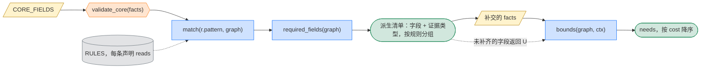

# 信息收集

**定位**：`fields.py`。定义每个案例收什么、何时收、由什么触发。`FIELDS` 固定，单个案例只激活一个子集，激活由程序算出。两条流程共用。

## 1. 类型与原则

```python
class Layer(Enum): CORE; CONDITIONAL; EX_POST

@dataclass
class Field:
    id: FieldId
    mount: Mount                                   # EVENT | ENTITY | HOLD | FLOW | PATH | SUBGRAPH
    type: type                                     # bool | Enum | number | date；门槛值在规则里，不在字段里
    layer: Layer
    active_if: Callable[[Graph, Elem], bool] | None    # CORE 为 None
    evidence: list[DocType]                        # 可接受的证据类型
    read_by: set[RuleId]                           # 由 Rule.reads 反向生成

FIELDS = CORE_FIELDS | {f.id: f for r in RULES for f in r.reads}
```

```python
# P1 字典来自规则库        len(FIELDS) 只在 RULES 变化时变化，不随案例变
# P2 案例需求可计算        required_fields(graph) 由程序给出，不设计扁平大表单
# P3 收集两步              先 CORE，再 required_fields()；未补齐照常运行，对应条件返回 U(MISSING)
# P4 字段必须有出处        facts.evidence(elem, field) 为空时，按 U(MISSING) 处理
# P5 DISCRETION 不入字典   它要什么证据是开放的，只进 conditions
# P6 名字以规则为准        check_fields 对照本表与 RuleObj.reads；表落后于规则时改表，不改规则
```

## 2. CORE_FIELDS：每案必收

`validate_core()` 只检查这一层，不全则 `raise Reject`。

| `mount` | 字段 | 证据 |
|---|---|---|
| `EVENT` | `flows, horizon, budget=None` | 无 |
| `ENTITY` | `id, type, incorporated_in, managed_from` | 注册文件、章程 |
| `HOLD` | `holder, held, ratio, since` | 股东名册 |
| `FLOW` | `payer, payee, income, amount, currency, on` | 合同、支付凭证 |

## 3. CONDITIONAL：按规则激活

字段名以规则实际读的为准（`python -m tax_graph.check_fields` 对照本表与 `RuleObj.reads`）。标"推出"的由 `facts.py` 从图算出，不收。

| 字段组 | `mount` | `active_if` | 字段 | 证据 |
|---|---|---|---|---|
| `residence_cert` | `ENTITY` | `claims_treaty(e)` | `cert_years, circumstances_changed_on=None` → 推出 `residence_cert` | 居民身份证明书 |
| `substance` | `ENTITY` | `e.loc in {HK, SG} and receives_foreign(e)` | `pure_equity_holding, registration_filing_compliant, substance_ruled_adequate` | 登记与申报记录、事先裁定书。人员、场所、开支、外包是裁量的证据，随 `Discretion.cites` 输出，不是字段 |
| `mne` | `ENTITY` | `e.loc is HK and receives_foreign(e)` | 推出 `is_mne_member`（持股连通分量跨法域）、`hk_resident_or_pe`（loc）；可由陈述覆盖 | 集团合并报表、居民身份 |
| `sg_recipient` | `ENTITY` | `e.loc is SG` | `is_excluded_entity, fixed_place_in_sg`；推出 `is_relevant_group_entity`（持股连通分量跨法域） | 集团架构、新加坡业务 |
| `transfer_pricing` | `FLOW` | 关联方之间的利息/特许权/服务费 | `related_party_volume`（payer，年度关联交易额）、`gross_revenue`、`revenue, total_assets, employees`（payer；香港 Sch 17I 三门槛→推出 `hk_tp_small_entity`）、`accounting_period_end`、`return_due_on`、`tp_documentation_provided`（payer）；事后：`tp_adjustment_tax, tp_adjustment_paid_on, pboc_benchmark_rate`（内地加收利息）、`tp_adjustment_amount`（新加坡附加税） | 关联申报表、同期资料、调整通知书 |
| `cfc` | `ENTITY` | 内地母公司 + 境外子公司 | `after_tax_profit`（已有）、`income_tax_other`（该子公司在本案各笔流之外缴纳的所得税：其自身经营利润的税；未知时实际税负只取下限，测试仍可能成立则列为待定并询问）；引擎推出 `cfc_tax_burden_ratio`（实际税负 ÷ 法定税率）、`cfc_profit_total`、`cfc_whitelisted`、`cfc_share_control`（单一 ≥10% 且合计 ≥50%，实施条例 §117(一)）；裁量：实质控制（§117(二)）、积极经营所得、合理经营需要 | 子公司财报、完税证明 |
| `vat` | `ENTITY/FLOW` | 内地付款的服务费/特许权；新加坡付款方进口服务 | `vat_general_taxpayer`（payer；新设公司为设计）；增值税法（2026 年起，口径 D23；此前的流见口径 D30）：`price_includes_vat`（FLOW，合同价款是否含税）、`service_consumed_on_site_abroad`（FLOW，服务是否在境外现场消费；服务在内地完成时推为否）、方案动作 `input_vat_documents_kept`（凭完税凭证抵扣须有合同、付款证明、对账单或发票）；利息（口径 D25）：`price_includes_vat`、`unified_borrowing_relending`（统借统还，集团外出借人推为否）；`gst_input_fully_recoverable`、`gst_recovery_ratio`（payer，%；新加坡 GST s14 反向征收：全额可抵免则不适用，否则成本 = 9% × (1 − 可抵扣比例)） | 增值税 / GST 登记、许可合同 |
| `residence` | `ENTITY` | 境外注册、中资控股的实体 | `incorporated_in`（缺省 = loc）、`managed_from`（法域码）、四项标准 `senior_management_in_cn, financial_hr_decisions_in_cn, records_in_cn, directors_majority_in_cn`；缺 `managed_from` 为待定事实，陈述 CN 且无一项为否则为认定裁量；内地持股链 <50% 时“主要控股投资者”亦为裁量（82 号文无数字）；引擎按"该实体为内地居民"的图变体取界 | 董事会纪要、账簿存放地、人事财务决策记录 |
| `restructuring` | `FLOW`（`reorg`） | 方案在现有 ULT→OP 之间插入新设 HOLD | `amount`（重组对价，即转让时 OP 股权的价格；未给须问）；方案动作 `reorg_equity_payment_share`、`reorg_operations_unchanged_12m`、`reorg_shares_kept_12m`、`reorg_commitment_3y`、`reorg_filed`、`stamp_relief_claimed`、`dividend_from_pre_reorg_profits`；判断 `reorg_reasonable_commercial_purpose`、`reorg_wht_burden_unchanged`；引擎推出 `reorg_step`、`reorg_control_ratio`、`reorg_acquired_ratio`、`reorg_same_residence`、`reorg_buyer_resident_in_cn`、`associated_ratio`、`cn_cost_basis`、`reorg_special_applied`（口径 D18） | 重组协议、备案表 |
| `ip_transfer` | `FLOW`（`iptx`） | 候选里持有 IP 的公司不是现持有人（口径 D22） | `amount`（IP 在转让日的市场价值，未给须问）、`ip_kind`、`cost_basis`（卖方尚未扣除的开支；内地为净值）、`ip_allowances_claimed`（卖方已获扣除或减值津贴）、`ip_book_value`（卖方账面价值，算当年利润与 GloBE 所得）、`ip_book_amortization`（买方每个建模年度的账面摊销额，算其 GloBE 所得与利润，口径 D27）；按账面划转（口径 D28，仅内地公司之间且同一内地母公司直接全资持有）另有方案动作 `reorg_operations_unchanged_12m`、`reorg_filed` 与判断 `asset_transfer_reasonable_purpose`、`price_includes_vat`、`cny_rate`（每单位案例币种折合人民币，技术转让 500 万元门槛用；流写明 `currency` 为 CNY 时不用）、`technology_export_restricted`、`ip_useful_life_years`（法律或合同规定的使用年限）、`instrument_used_in_cn`（双方都在境外时书据是否在内地使用）、`receipt_kind`、`qualifying_rd_expenditure`、`non_qualifying_expenditure`（香港卖方的研发分数）；方案动作 `tech_transfer_registered`、`vat_tech_recognized`、`input_vat_documents_kept`；判断 `ip_transfer_gain_sourced_in_cn`、`tech_transfer_between_sisters_allowed`、`tech_recognition_open_to_foreign_seller`、`ip_gain_sourced_in_hk`、`ip_held_as_capital_asset`；引擎推出 `ip_parties_100pct_held`、`ip_parties_100pct_sisters`、`cn_party`、`seller_had_sg_creation_deductions`、`ip_horizon_years`、`ip_transfer_step` | IP 转让协议、评估报告、权属证书、技术合同认定登记证明、卖方财务报表与以前年度税务计算 |
| `unwinding` | `FLOW`（`unwind`、`wind`） | 方案撤销客户现有的 HOLD，或把它的角色交给另一法域的新公司 | unwind 的 `amount`（HOLD 所持 OP 股权在转出日的市场价值）与 OP 股权转让的各项事实；wind 的 `amount`（HOLD 清算时分配给 ULT 的全部剩余财产）、`accumulated_profits_share` 与收款方事实；两个金额未给须问；方案动作 `stamp_relief_claimed`、`clawback_event_within_2y`、`asset_disposed_within_2y`；引擎推出 `unwind_step`、`shares_cancelled`、方案自身后续转让造成的追缴（口径 D19） | 评估报告、清算方案、资产负债表 |
| `pillar_two` | `ENTITY` | 集团合并收入 ≥ 7.5 亿欧元 | `group_revenue_eur`、`globe_income`、`covered_taxes_other`（模型外的有效税负税额）、`sbie`（基于实质的所得排除额；未陈述时由 `payroll`、`tangible_assets` 按 GloBE 5.3 与 9.2 过渡税率算出）；`covered_taxes_other` 只填模型外的有效税负税额（引擎已算的流税项由引擎自己加进去，勿重复）；按法域合计：同一法域每个成员都要有 `globe_income`，法域无净所得时每个成员都要有 `covered_taxes_other`；集团事实 `p2_negative_tax_election`（新加坡第 21(2) 条选择，事前为方案动作）、`p2_carry_back_topup`（选择后仍留在当年的亏损追溯部分）；过渡期国别报告安全港与微利豁免（口径 D17）用法域的集团事实（后缀 `_hk`、`_sg`）：`p2_qualified_cbcr`、`p2_tcsh_history`、`p2_cbcr_revenue`、`p2_cbcr_pbt`、`p2_cbcr_simplified_taxes`（案例币种）、`p2_dm_avg_revenue_eur`、`p2_dm_avg_income_eur`、`p2_tcsh_elected`、`p2_dm_elected`，以及 `p2_eur_rate`（每单位案例币种折合欧元）；两项选择事前为方案动作；引擎推出 `p2_etr`、`p2_additional`；收入纳入规则（口径 D20）：港新母公司适用 IIR 时，内地成员也要 `globe_income`、`covered_taxes_other`、`payroll`、`tangible_assets` 与带后缀 `_cn` 的国别报告、三年平均数；引擎推出 `p2_iir` | GloBE 信息申报、合并报表、集团支柱二计算底稿 |
| `rates` | `ENTITY` | 实体自身课税或扣除时 | `cit_rate`（该实体对此类所得适用的边际税率，%：内地高新 15%、香港两级制 8.25%、新加坡部分免税后的边际；缺省回落名义税率） | 高新证书、评税通知、申报表 |
| `fixed_place` | `ENTITY` | `e` 收取境外服务费 | `fixed_place_in_cn, fixed_place_in_hk`（与 `fixed_place_in_sg` 同义，按来源地）；常设机构门槛由 `service_days_12m` 定 | 登记、租约、人员记录 |
| `dividend_relief` | `FLOW` | `f.income is DIVIDEND and treaty(f).instrument is not NONE` | 推出 `direct_ratio, holding_months`（HOLD 与 `accrued_on`；持股是核心字段，无边即 0，不是未知） | 股东名册 |
| `reinvestment` | `FLOW` | `f.income is DIVIDEND and f.payer.loc is CN` | `reinvested_in_cn, reinvestment_form, direct_payment, reinvestment_from_distributed_profit, investee_encouraged_industry, planned_holding_months` | 增资、新设或收购文件、银行流水、《利润再投资情况表》、鼓励目录对照 |
| `beneficial_owner` | `PATH` | `claims_treaty(f.payee)` | `bo_safe_harbour`；推出 `onpay_ratio_12m`（收款后 12 个月内付给第三地居民的流 ÷ 所得，流图）、`bo_via_100pct_owner`（HOLD 子图）；陈述值覆盖推出值 | 合同、银行流水、完税证明 |
| `interest` | `FLOW` | `f.income is INTEREST` | `government_exempt_condition_met, related_party_debt_equity_ratio, loan_purpose_income_producing`（payer）、`lender_interest_taxable_in_hk`（payee）、`interest_rate, benchmark_rate, arms_length_max, wht_borne_by_payer, vat_borne_by_payer`（FLOW：利率与金融企业同期同类利率，%；独立交易区间上限，金额；合同约定所得税预提 / 代扣增值税由付款方承担）；推出 `payee_is_financial_institution, payee_is_government`（`Entity.type`）、`payee_is_related`（HOLD） | 贷款合同、财务报表 |
| `service` | `FLOW` | `f.income is SERVICE_FEE` | `service_location`（履行地法域码）或 `service_onshore_share`（在来源地履行的份额，%；内地只对境内部分核定征税，实施条例第 7 条）→ 推出 `service_performed_in_source, service_performed_in_residence`；`service_days_12m`（人员在来源地任何 12 个月内的天数）、`service_kind`（取值 MANAGEMENT / ENGINEERING_DESIGN_CONSULTING / OTHER，内地核定利润率档，国税发〔2010〕19 号第五条）、`profit_margin`（服务费中的利润，%，香港 s14 按利润课税） | 服务合同、出入境与考勤记录、项目账簿 |
| `distribution` | `FLOW` | `f.income in {LIQUIDATION, CAPITAL_REDUCTION}` | `accumulated_profits_share`（股东按比例应分的累计未分配利润与盈余公积，金额；缺失则引擎按端点与拐点取界并列为待定）、`reduced_capital_ratio`（减资占实收资本的 %，减资时成本按此分摊）；拆成股息部分与转让部分后再按上两组收 | 清算报告、减资决议、资产负债表 |
| `royalty` | `FLOW` | `f.income is ROYALTY` | `is_equipment_lease, is_aircraft_or_ship_lease, ip_used_in_hk, royalty_deductible_in_hk, payee_is_associate, ip_never_owned_by_hk_business` | 许可合同、知识产权登记 |
| `ip_nexus` | `FLOW` | `f.income is ROYALTY and f.payee.loc is HK and receives_foreign(f.payee)` | `qualifying_rd_expenditure, non_qualifying_expenditure` | 研发账簿 |
| `share_transfer` | `FLOW` | `f.income is SHARE_TRANSFER` | `immovable_ratio, listed_market_trade, held_as_trading_stock, acquirer_chargeable_in_hk, clawback_event_within_2y, asset_disposed_within_2y`；推出 `consideration`（= amount）、`cost_basis, max_ratio_12m, ratio, holding_months, intragroup_transfer`（HOLD） | 转让协议、财务报表、存货记录、买方课税地位 |
| `indirect_transfer` | `SUBGRAPH` | 推出 `indirect_cn_target`（标的子树含 CN） | `cn_value_ratio, cn_asset_ratio, cn_income_ratio, limited_functions_and_risks, foreign_tax_lower_than_cn, intragroup_reorg_ratio, reorg_consideration_in_equity, later_cn_tax_not_reduced` | 财务报表、架构图、估值报告 |
| `foreign_income_exemption` | `FLOW` | `f.payee.loc in {HK, SG} and f.payer.loc is not f.payee.loc` | `receipt_kind, accrued_on=None, foreign_taxed, foreign_headline_rate, underlying_profits_taxed, deductible_at_payer` | 银行流水、境外完税证明、付款方申报表 |
| `foreign_tax_credit` | `FLOW` | 居民地对该流课税 | `ftc_pooling_election`（ENTITY，新加坡 s50C 池化选择）；`underlying_tax_share`（内地居民收境外股息、直接持股 ≥20%：被投资方就该股息所负担的税额占股息的 %，财税〔2009〕125 号第五条公式；未陈述时由引擎按第五条逐层推出：付款方本层实缴税额（本案各笔流上它作为纳税人的税项 + `income_tax_other`，方案新设公司后者为 0）加上它从合格下层（第六条、财税〔2017〕84 号第二条：单一上层直接 ≥20%、居民企业合计 ≥20%，五层）收到股息所间接负担的税额，× 股息 ÷ `after_tax_profit`；任一层缺 `income_tax_other` 或 `after_tax_profit` 时列为待定——下界全额抵免、上界取数据所允许的最小值，并询问所缺数据）；事前抵免额由同一笔所得的来源地税项算出，事后 `foreign_tax_rate` | 境外完税证明、池化选择 |
| `procedure` | `FLOW` | 总是 | `payable_on, as_at, period_to, remitted_on, tax_paid_on, first_notification_on, authority_action, prior_map_outcome, assessment_notice_on, determination_on, tax_paid_or_secured`；推出 `date_of_payment`（= on） | 支付凭证、申报表、评税通知、裁定书 |

```python
# 枚举：receipt_kind ∈ {REMITTED, DEBT_SETTLED, MOVABLE_PROPERTY, NONE}        # IRO s15H(5)、ITA s10(25) 同构
#       reinvestment_form ∈ {capital_increase, new_entity, unrelated_acquisition, listed_shares}
# 日期：accrued_on 定持股期（s15M(2)），on 定课税与扣缴；payable_on 定内地扣缴义务（企业所得税法第 37 条）
# 推导项不入字典：loc（双重居民无协商结果时 U(DISCRETION)）、relief_mode（抵免/扣除）、source_in_hk、bo_chain
# 汇率不收：扣缴义务发生之日的人民币汇率中间价，official/tools/fx_cny.py
# 单位：比率字段一律百分数（与 params.csv 的 % 一致），债资比例用倍数，期间字段一律月
#       authority_action ∈ {none, assessment, denial, adjustment}；prior_map_outcome ∈ {none, withdrawn, result_refused}
# 实体级规则（跨流）：新加坡 s50C 池化、内地再投资抵免（2025–2028）由 engine 的实体阶段按实体汇总；未写：反对或上诉的国内救济分支
```

## 4. EX_POST：按偏差项收

| `mount` | 字段 | 证据 |
|---|---|---|
| `FLOW` | `actual`（该流实际缴纳的税额）、`tax_paid_on, remitted_on, first_notification_on` | 扣缴凭证、缴款书、通知书 |
| `ENTITY` | `sch17k_elected` | 书面选择 |

时效不单独收集：每条流的时钟由规则层的 `DEADLINE` 规则算在标签上（退税自缴税起、相互协商自首次通知起、反对/上诉/复议自评税通知或裁定起），`PATHS` 列出可走的路线，全部过期才归档。

## 5. 激活与收集

```python
def required_fields(graph) -> set[FieldKey]:              # 静态上界；EX_ANTE 对全部候选取并集
    return {(e, f) for r in RULES for e in match(r.pattern, graph) for f in r.reads}

needs = bounds(graph, ctx).groups                         # 动态；已知事实短路后的剩余
assert flatten(needs) <= required_fields(graph)
```



`needs` 按规则分组。一组内的字段要一并补齐才起作用，组按 `cost[g]` 排序。逻辑见 [伪代码.md](伪代码.md)。

## 6. 维度何时会变

| 情形 | `FIELDS` | `required_fields(graph)` |
|---|---|---|
| 换一个案例 | 不变 | 变，由 `match()` 唯一决定 |
| `ex_ante` 换候选结构 | 不变 | 变，已对全部候选取并集 |
| `RULES` 新增规则或管辖区 | 变大 | 可能变 |
| 规则版本更新 | `reads` 不变则不变 | 不变 |

版本增量的字段写在对应版本文档里。

## 7. 示例：场景 B

CN 运营公司向 HK 控股公司付股息，被按国内法扣缴，事后主张《安排》优惠。

```python
required_fields(graph_B) == fields_of(
    CORE,                                   # 2 个 Entity，1 条 HoldEdge，1 条 DIVIDEND FlowEdge
    residence_cert, substance, mne, ruling, dividend_relief, reinvestment, beneficial_owner,
    foreign_income_exemption, foreign_tax_credit,
    EX_POST.FLOW)                           # withheld, withheld_on, treaty_form_filed
# 未激活：withholding_timing, interest, royalty, ip_nexus, share_transfer, indirect_transfer
```
